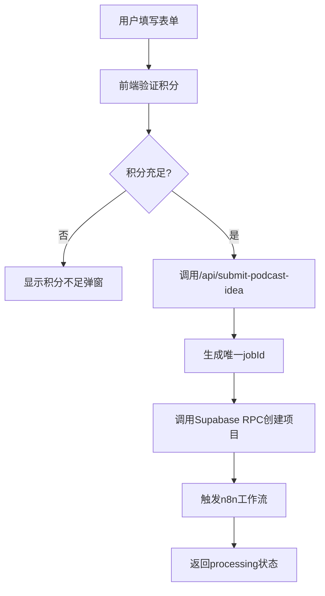
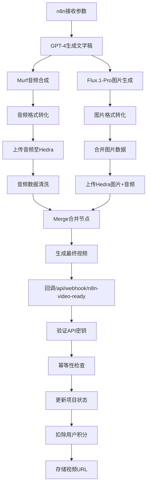

# AI Creative Suite: 多功能AI创作平台

AI Creative Suite 是一个基于 Next.js 的全栈Web应用，提供三个强大的AI创作工具：AI Baby Podcast Generator、AI Baby Generator 和 Face-to-Many-Kontext。用户可以通过统一的账户系统和积分系统访问所有功能，创建各种类型的AI生成内容。

## 🎯 三大核心功能

### 1. AI Baby Podcast Generator
- 生成个性化的宝宝播客视频，支持自定义种族、发型和播客主题
- 通过n8n工作流自动生成高质量的AI视频内容
- 完全可用，支持视频生成和下载

### 2. AI Baby Generator
- 通过结合父母照片生成AI宝宝图像
- 参考 aibabygenerator.io 的功能设计
- 目前处于开发阶段

### 3. Face-to-Many-Kontext
- AI面部转换和风格迁移技术
- 支持多种上下文和风格变换
- 计划中的功能，正在开发

## ✨ 核心功能特性

### 🎬 AI视频生成引擎
- **个性化定制**: 支持自定义宝宝种族（亚洲、中东、非裔美国、白种人等）和发型样式（卷发、马尾、平头、波波头等）
- **四重AI驱动**: GPT-4文字创作 + Murf.ai语音合成 + Flux.1-Pro图像生成 + Hedra视频制作
- **智能主题解析**: 用户输入任意播客主题，AI将自动生成相应的文字稿、配音和视觉内容
- **并行处理架构**: 音频和图片同时生成，整体处理时间仅需2-3分钟
- **高质量输出**: 生成的视频支持在线播放和下载，格式为MP4

### 💳 积分与计费系统
- **智能计费**: 基于视频时长的按秒计费模式，公式为 `Math.ceil(duration_ms / 1000)`
- **积分管理**: 新用户注册自动获得20积分，支持积分余额查询
- **防重复扣费**: 实现了webhook幂等性检查，防止多次回调导致的重复扣费
- **余额不足保护**: 积分不足时自动拦截请求并提示用户

### 🔐 用户认证与权限
- **Supabase Auth**: 集成Supabase认证系统，支持邮箱注册/登录
- **会话管理**: 自动处理用户会话状态和权限验证
- **RLS安全**: 实现行级安全策略，确保数据访问安全

### 📊 项目管理Dashboard
- **实时状态**: 支持processing、completed、failed等状态实时更新
- **项目历史**: 用户可查看所有历史项目和生成记录
- **视频预览**: 内置视频播放器，支持在线预览生成的视频
- **批量管理**: 响应式网格布局，支持多项目同时管理

### 🔗 n8n工作流集成
- **异步处理**: 提交后立即返回，后台异步处理视频生成
- **四重AI引擎**: 集成GPT-4文字生成、Murf音频合成、Flux.1-Pro图片生成、Hedra视频制作
- **并行处理**: 音频和图片生成同时进行，提升处理效率
- **Webhook回调**: n8n完成后自动回调更新项目状态
- **错误处理**: 完善的错误处理和状态管理机制
- **安全验证**: 使用API密钥验证n8n回调的合法性

## 🛠️ 技术架构栈

### 前端技术
- **框架**: Next.js 15.3.1 (App Router)
- **UI库**: React 19.0.0 + TypeScript 5+
- **样式**: Tailwind CSS 4 + 自定义组件
- **图标**: Lucide React 0.511.0
- **状态管理**: React Hooks + Zustand (规划中)
- **日期处理**: date-fns 4.1.0

### 后端架构
- **运行时**: Next.js API Routes
- **数据库**: Supabase (PostgreSQL)
- **认证**: Supabase Auth (@supabase/ssr 0.6.1)
- **文件存储**: Cloudflare R2 (通过外部视频URL)
- **工作流**: n8n.io 自动化平台

### 开发工具
- **类型检查**: TypeScript + @types/*
- **代码规范**: ESLint 9 + eslint-config-next
- **构建工具**: Next.js Turbopack
- **部署**: Vercel

### 第三方集成
- **文字生成**: OpenAI GPT-4 API
- **音频合成**: Murf.ai Text-to-Speech API
- **图片生成**: Flux.1-Pro Image Generation API
- **视频制作**: Hedra.com AI Video API
- **工作流**: n8n.io 自动化编排
- **支付网关**: Stripe Payment Gateway
- **HTTP客户端**: Axios 1.9.0
- **UUID生成**: uuid 11.1.0
- **分析工具**: Google Analytics + Microsoft Clarity

## 📂 项目架构图

```
AI-Creative-Suite/
├── src/
│   ├── app/                    # Next.js App Router (主应用逻辑)
│   │   ├── api/                # API端点
│   │   │   ├── auth/           # 认证相关API
│   │   │   ├── submit-podcast-idea/ # 项目提交API
│   │   │   └── webhook/        # n8n回调接收
│   │   │       └── n8n-video-ready/
│   │   ├── ai-baby-podcast/    # AI Baby Podcast Generator
│   │   │   ├── dashboard/      # Podcast 控制台
│   │   │   └── page.tsx        # Podcast 功能页面
│   │   ├── ai-baby-generator/  # AI Baby Generator
│   │   │   ├── dashboard/      # Baby Generator 控制台
│   │   │   └── page.tsx        # Baby Generator 功能页面
│   │   ├── face-to-many-kontext/ # Face-to-Many-Kontext
│   │   │   ├── dashboard/      # Face Kontext 控制台
│   │   │   └── page.tsx        # Face Kontext 功能页面
│   │   ├── dashboard/          # 重定向到默认工具
│   │   │   ├── projects/       # 项目管理页面
│   │   │   └── page.tsx        # 重定向页面
│   │   ├── login/              # 登录注册页面
│   │   ├── pricing/            # 定价页面
│   │   ├── privacy-policy/     # 隐私政策
│   │   ├── terms-of-service/   # 服务条款
│   │   ├── layout.tsx          # 根布局
│   │   └── page.tsx            # 新首页（功能选择）
│   ├── components/             # React组件库
│   │   ├── auth/               # 认证组件
│   │   ├── modals/             # 弹窗组件
│   │   │   ├── ConfirmationModal.tsx
│   │   │   └── InsufficientCreditsModal.tsx
│   │   ├── DashboardClient.tsx # 控制台主界面
│   │   ├── DashboardSiderbar.tsx # 侧边栏导航
│   │   └── ProjectsClient.tsx  # 项目列表组件
│   ├── hooks/                  # 自定义React Hooks
│   ├── lib/                    # 工具库和配置
│   ├── types/                  # TypeScript类型定义
│   │   └── project.ts          # 项目数据模型
│   ├── utils/                  # 工具函数
│   │   └── supabase/           # Supabase客户端配置
│   │       ├── client.ts       # 客户端配置
│   │       ├── server.ts       # 服务端配置
│   │       └── middleware.ts   # 中间件配置
│   └── middleware.ts           # Next.js中间件
├── public/                     # 静态资源
├── .env.local                  # 环境变量配置
├── next.config.mjs             # Next.js配置
├── package.json                # 项目依赖
├── tsconfig.json               # TypeScript配置
├── tailwind.config.js          # Tailwind CSS配置
└── 数据库.md                   # 数据库设计文档
```

## 🔄 业务流程架构

### 1. 用户提交流程


### 2. n8n工作流处理流程


## 🎨 前端组件与交互优化

### `AudioTrimUpload` 组件问题修复 (2024-06-06)
- **问题描述**: 用户上传音频后，无法通过拖拽选择音频片段进行裁剪，波形图上仅显示一条线，期望为两条可选区边界线。
- **原因分析**: `wavesurfer.js` 的 Regions 插件需要为选区句柄 (handles) 定义 CSS 样式才能使其可见并可交互。
- **解决方案**: 在 `src/components/audio/audio-trim-upload.tsx` 文件中，为 `.wavesurfer-handle` 类添加了明确的 CSS 样式，使其能够正确显示选区的开始和结束标记，从而允许用户进行拖拽选择。

### 3. 数据库设计

#### 核心表结构
```sql
-- 用户配置表
user_profiles (
  user_id UUID PRIMARY KEY,
  credits INTEGER DEFAULT 20,
  created_at TIMESTAMPTZ DEFAULT NOW(),
  updated_at TIMESTAMPTZ DEFAULT NOW()
)

-- 项目表
projects (
  id UUID PRIMARY KEY DEFAULT gen_random_uuid(),
  user_id UUID REFERENCES auth.users(id),
  job_id UUID UNIQUE NOT NULL,
  ethnicity TEXT NOT NULL,
  hair TEXT NOT NULL,
  topic TEXT NOT NULL,
  status TEXT DEFAULT 'processing',
  video_url TEXT,
  duration INTEGER, -- 视频时长(毫秒)
  created_at TIMESTAMPTZ DEFAULT NOW(),
  updated_at TIMESTAMPTZ DEFAULT NOW()
)
```

#### 核心RPC函数
- `handle_new_user()`: 新用户注册触发器，自动分配20积分
- `create_initial_project()`: 创建新项目并检查积分
- `deduct_credits_by_duration()`: 基于视频时长扣除积分

## 🚀 快速启动指南

### 环境要求
- Node.js 18+
- npm/pnpm/yarn
- Supabase账户
- n8n实例(云端或自部署)

### 1. 项目设置
```bash
# 克隆项目
git clone <repository-url>
cd AI-Baby-Podcast

# 安装依赖
npm install

# 复制环境变量模板
cp .env.local.example .env.local
```

### 2. 环境变量配置
```env
# Supabase 配置
NEXT_PUBLIC_SUPABASE_URL=your_supabase_url
NEXT_PUBLIC_SUPABASE_ANON_KEY=your_supabase_anon_key
SUPABASE_SERVICE_ROLE_KEY=your_service_role_key

# n8n 配置
N8N_WEBHOOK_URL=your_n8n_trigger_webhook_url
N8N_API_KEY=your_shared_secret_key

# Stripe 支付配置
NEXT_PUBLIC_STRIPE_PUBLISHABLE_KEY=pk_test_... # Stripe 公开密钥
STRIPE_SECRET_KEY=sk_test_... # Stripe 私有密钥
STRIPE_WEBHOOK_SECRET=whsec_... # Stripe Webhook 密钥
NEXT_PUBLIC_SITE_URL=http://localhost:3000 # 应用的基础 URL，用于构建支付回调地址 (生产环境请替换为实际域名)

# Analytics (可选)
NEXT_PUBLIC_GA_ID=G-MJ7Q9993FF
```

### 3. 数据库初始化
参考 `数据库.md` 文档在Supabase中创建：
- 表结构 (`user_profiles`, `projects`)
- RPC函数 (`handle_new_user`, `create_initial_project`, `deduct_credits_by_duration`)
- RLS安全策略
- 数据库触发器

### 💳 Stripe 支付集成配置

本项目集成了 Stripe 作为支付网关，用于处理用户购买积分套餐和积分包的支付流程。

**核心流程：**
1. 用户在前端选择套餐/积分包并发起支付请求到 `/api/payment/create-checkout`。
2. 后端API验证用户并调用 Stripe API 创建一个 checkout session。
3. 用户在嵌入式支付表单中完成支付。
4. 支付成功后，Stripe 通过 webhook 通知后端 `/api/webhook/stripe`。
5. Webhook 处理器负责：
    - 验证 Stripe webhook 签名的有效性。
    - 检查重复支付。
    - 调用 Supabase RPC 函数 (`add_credits`) 为用户增加相应积分。
    - 在 `payments`, `payment_intents`, `subscriptions` 表中记录支付和订阅信息。

**产品ID配置：**

Stripe 价格ID需要在 `src/app/api/payment/create-checkout/route.ts` 中配置：

当前的测试价格ID：
- **Starter Plan**: `price_1RZjRTFNBa78cTTjgLPvumhq` (200 积分)
- **Pro Plan**: `price_1RZjRTFNBa78cTTjSAjAy1el` (550 积分)
- **Creator Plan**: `price_1RZjRTFNBa78cTTjwMXWtJtE` (1200 积分)

*注意：上线前务必将这些测试ID替换为在 Stripe **生产环境**中创建的实际价格ID。*

**数据库操作权限：**

为了确保对支付相关表（`payments`, `payment_intents`, `subscriptions`）的写入操作以及调用 `add_credits` RPC 函数具有足够的权限（绕过或满足RLS策略），后端支付API 和 webhook 中涉及这些操作的部分使用了通过 `SUPABASE_SERVICE_ROLE_KEY` 初始化的 `supabaseAdmin` 客户端。

**Webhook 安全：**

Stripe webhook 的签名验证逻辑位于 `/api/webhook/stripe/route.ts` 中，使用 Stripe 官方的签名验证方法确保请求的合法性。

### 4. n8n工作流配置

#### 工作流架构
- **触发器**: Webhook节点接收来自 `/api/submit-podcast-idea` 的POST请求
- **输入参数**: `jobId`, `ethnicity`, `hair`, `topic`

#### AI服务集成
- **GPT-4节点**: 基于用户主题生成播客文字稿
- **Murf音频节点**: 将文字稿转换为AI语音
- **Flux.1-Pro图片节点**: 生成相关主题的AI图片
- **Hedra视频节点**: 合成音频和图片为最终视频

#### 数据处理流程
- **并行处理**: 音频和图片生成同时进行
- **格式转化**: 确保音频和图片格式兼容
- **数据清洗**: 优化音频质量和图片参数
- **合并节点**: 整合所有处理结果

#### 回调配置
- **HTTP请求节点**: 发送结果到 `/api/webhook/n8n-video-ready`
- **认证**: 请求头 `Authorization: Bearer YOUR_N8N_API_KEY`
- **回调数据**: `jobId`, `videoUrl`, `duration`, `status`

### 5. 启动开发服务器
```bash
npm run dev
```
访问 `http://localhost:3000` 开始使用

## 📊 功能特性详解

### 积分系统
- **初始积分**: 新用户注册自动获得20积分
- **消费规则**: 按视频时长计费，公式 `Math.ceil(duration / 1000)` 秒
- **余额保护**: 积分不足时自动拦截请求
- **历史记录**: 每个项目显示实际消费的积分数量

### 安全特性
- **认证中间件**: Next.js中间件自动处理Supabase会话
- **API安全**: 所有API端点都有认证检查
- **Webhook安全**: n8n回调使用共享密钥验证
- **幂等性**: 防止重复webhook调用导致的多次扣费
- **RLS策略**: 数据库级别的行级安全控制

### 用户体验
- **响应式设计**: 支持桌面和移动设备
- **实时状态**: 项目状态实时更新(processing → completed)
- **错误处理**: 友好的错误提示和恢复机制
- **加载状态**: 完善的loading和skeleton screen

### 性能优化
- **服务器组件**: 优先使用React Server Components
- **动态导入**: 非关键组件使用动态加载
- **图片优化**: Next.js自动图片优化
- **缓存策略**: 合理的API缓存策略
- **并行处理**: n8n工作流中音频和图片并行生成，减少总处理时间

## 🎨 n8n工作流详细架构

### AI服务提供商
| 服务类型 | API提供商 | 功能描述 | 处理节点 |
|---------|-----------|----------|---------|
| 🤖 文字生成 | OpenAI GPT-4 | 基于主题生成播客文字稿 | `gpt4生成文字稿` |
| 🎵 音频合成 | Murf.ai | 文字转语音，生成AI播客音频 | `访问Murf生成音频` |
| 🖼️ 图片生成 | Flux.1-Pro | 生成主题相关的AI图片 | `flux.1-pro生成图片` |
| 🎬 视频制作 | Hedra.com | 合成音频和图片为最终视频 | `上传Hedra系列节点` |

### 工作流执行策略
- **并行架构**: 音频和图片生成同时进行，提升50%处理效率
- **数据流管理**: 自动处理格式转换和数据清洗
- **错误恢复**: 每个API调用都有重试和错误处理机制
- **质量控制**: 音频和图片都经过质量检查和优化

### 处理时间估算
- 文字生成: ~10-20秒
- 音频合成: ~30-60秒
- 图片生成: ~20-40秒 (并行)
- 视频合成: ~60-120秒
- **总计**: 约2-3分钟完成整个流程

## 🔧 开发和部署

### 开发脚本
```bash
npm run dev      # 启动开发服务器(Turbopack)
npm run build    # 生产构建
npm run start    # 启动生产服务器
npm run lint     # 代码检查
```

### 部署选项
- **Vercel**: 推荐，与Next.js无缝集成
- **Cloudflare Pages**: 支持边缘计算
- **自部署**: 支持Docker容器化部署

### 环境配置
- **开发环境**: 使用 `localhost:3000`
- **生产环境**: 确保所有环境变量正确配置
- **数据库**: Supabase生产实例
- **监控**: 集成Google Analytics和Microsoft Clarity

## 📋 待开发功能

### 即将发布 (高优先级)
- [ ] **支付集成**: Stripe/PayPal积分充值系统
- [ ] **用户套餐**: 月度/年度订阅计划
- [ ] **API限流**: 防止滥用的请求限制
- [ ] **邮件通知**: 视频完成后的邮件提醒

### 计划中功能 (中优先级)
- [ ] **视频模板**: 预设的播客风格模板
- [ ] **批量生成**: 支持一次提交多个项目
- [ ] **社交分享**: 一键分享到社交媒体
- [ ] **数据分析**: 用户使用情况统计dashboard

### 长期规划 (低优先级)
- [ ] **多语言支持**: 国际化(i18n)
- [ ] **团队协作**: 多用户协作功能
- [ ] **API开放**: 提供第三方集成API
- [ ] **移动应用**: React Native移动端

## 📝 更新日志

### v2.1.1 配色统一优化 (2025-01-20)
- ✅ **配色统一**: 所有Dashboard页面现在与Projects页面保持一致的配色风格
  - 移除背景图片和主题色遮罩层
  - 统一使用黄色主题配色 (border-[#f5eecb], 黄色边框和背景)
  - 所有卡片使用白色半透明背景 (bg-white/80, bg-white/70)
- ✅ **布局优化**:
  - AI Baby Podcast Dashboard: 简化布局，移除蓝色主题
  - AI Baby Generator Dashboard: 简化布局，移除紫色主题
  - Face-to-Many-Kontext Dashboard: 简化布局，移除绿色主题
- ✅ **组件样式统一**:
  - DashboardClient组件恢复黄色主题样式
  - 统一文字颜色和对比度
  - 保持与Projects页面一致的视觉体验

### v2.1.0 UI优化和配色重构 (2025-01-20)
- ✅ **侧边栏优化**:
  - 删除Create按钮，简化导航结构
  - AI Tools改为下拉选择器，支持点击外部关闭
  - Projects按钮大小与工具选择器保持一致
  - 优化整体布局，减少拥挤感
  - 改进hover效果和视觉层次

### v2.0.0 多功能平台重构 (2025-01-20)
- ✅ **架构重构**: 将单页面应用重构为多功能平台
- ✅ **新首页**: 创建展示三个AI工具的入口页面
- ✅ **AI Baby Podcast Generator**: 移植原首页内容到独立页面
- ✅ **AI Baby Generator**: 新增AI宝宝图像生成功能页面（开发中）
- ✅ **Face-to-Many-Kontext**: 新增面部转换功能页面（计划中）
- ✅ **多功能Dashboard**: 为每个工具创建独立的控制台页面
- ✅ **统一侧边栏**: 支持多工具导航和积分显示
- ✅ **路由重构**: 实现 `/ai-baby-podcast/`, `/ai-baby-generator/`, `/face-to-many-kontext/` 路由
- ✅ **用户体验**: 保持统一的认证系统和积分管理
- ✅ **文档更新**: 更新 README.md 反映新的架构

### v1.0.0 MVP版本 (2025-01-20)
- ✅ 核心视频生成功能完成
- ✅ 用户认证系统集成
- ✅ 积分计费系统实现
- ✅ n8n工作流集成完成
- ✅ 响应式UI界面优化
- ✅ 数据库设计和RPC函数
- ✅ Webhook幂等性处理
- ✅ 法律页面(隐私政策/服务条款)
- ✅ 错误处理和用户体验优化

### 技术债务修复
- ✅ 修复多次webhook回调导致的重复扣费问题
- ✅ 实现项目状态幂等性检查
- ✅ 优化数据库RPC函数错误处理
- ✅ 改进API响应格式和错误信息
- ✅ 统一代码风格和TypeScript类型定义

### 安全加固
- ✅ 加强API端点认证验证
- ✅ 实现Webhook安全密钥验证
- ✅ 完善RLS数据库安全策略
- ✅ 添加请求参数验证和清理

### 2024-07-27
- **优化**: 将 `src/components/Footer.tsx` 中的 `` 标签替换为 Next.js 的 `Image` 组件，以提升 LCP 性能并解决 ESLint 警告。
- **AI 可发现性**: 
    - 更新 `public/robots.txt` 文件：为特定 AI 爬虫（GPTBot, Claude-Web, Anthropic-AI, PerplexityBot, GoogleOther, DuckAssistBot）添加了独立的 `User-agent` 规则块，并正确引入 `LLM-Content` 和 `LLM-Full-Content` 指令，以更好地引导 AI 模型理解网站内容。
    - 添加 `public/llms.txt` 文件，向 AI 模型提供网站核心内容的简洁摘要和链接。
    - 添加 `public/llms-full.txt` 文件（占位符结构），用于未来填充更详细的网站内容摘要，以增强 AI 理解。
    - 将 `public/llms.txt` 和 `public/llms-full.txt` 的内容翻译为英文。
    - 在 `public/llms.txt` 的 "Core Content" 部分新增了基于 `WhatIs.tsx` 和 `Why.tsx` 组件内容的条目，链接至相应的首页锚点 (`#what-is` 和 `#why-trending`)。
    - 使用来自相应组件和页面的实际内容摘要填充了 `public/llms-full.txt` 的所有部分（Homepage, Features, Pricing, How It Works, What is AI Baby Podcast?, Why AI Baby Podcast is Trending, FAQ, Privacy Policy, Terms of Service）。

### 2024-07-28
- **站点验证**: 将 `startupranking1337891618924910.html` 文件移动到 `public` 目录，使其可以通过 `https://www.babypodcast.pro/startupranking1337891618924910.html` 访问，用于站点所有权验证。
- **添加 Google AdSense 脚本到主布局文件，用于展示广告。**
- **创建 `public/ads.txt` 文件以符合 Google AdSense 的要求，等待用户提供发布商ID进行更新。**

### 2024-07-29
- **元数据优化**: 全局替换项目中的 "AI Baby Podcast" 和 "AI Baby Podcast Generator" 为 "AI Baby Generator"，并更新相关描述。

### 2024-07-29 (UI更新)
- **组件更新**:
    - `src/components/Header.tsx`: 将Logo文本从 "AI Baby Podcast" 更新为 "AI Baby Generator"。
    - `src/components/Hero.tsx`: 为标题 "AI Baby Generator" 添加 `whitespace-nowrap` Tailwind CSS 类，防止其在显示时换行。
    - `src/components/Footer.tsx`: 将版权信息中的 "AI Baby Podcast" 更新为 "AI Baby Generator"。

### 2024-07-30 (博客功能)
- **新功能**: 添加博客系统。
    - 创建博客数据文件 `src/lib/blog-data.ts`，包含博文接口、示例数据和辅助函数。
    - 创建博客列表页面 `src/app/blog/page.tsx`，展示博文标题、作者、日期和摘要。
    - 创建单篇博文页面 `src/app/blog/[slug]/page.tsx`，展示博文完整内容，并动态生成元数据。
    - 创建博客布局文件 `src/app/blog/layout.tsx`，包含通用Header、Footer和元数据。
    - 在 `src/components/Header.tsx` 中添加指向博客页面的导航链接。
    - 博文内容样式通过直接在JSX中使用Tailwind CSS类实现，未引入额外依赖。

## 🤝 技术支持

### 联系方式
- **技术支持**: m15905196940@163.com
- **项目文档**: 查看项目内 `数据库.md` 和相关技术文档
- **问题反馈**: 通过GitHub Issues或邮件联系

### 开发团队
- **架构设计**: Next.js + Supabase + n8n
- **前端开发**: React 19 + TypeScript + Tailwind CSS
- **后端开发**: Next.js API Routes + PostgreSQL
- **DevOps**: Vercel部署 + 自动化CI/CD

### 2024-07-29 (UI更新)
- **组件更新**:
    - `Header.tsx`: Logo文本更新为 "AI Baby Generator"。
    - `Hero.tsx`: 标题 "AI Baby Generator" 应用 `whitespace-nowrap` 防止换行。
    - `Footer.tsx`: 版权文本更新为 "AI Baby Generator"。

### 2024-07-30 (博客功能)
- **新功能**: 添加博客页面 (`/blog`) 及文章详情页 (`/blog/[slug]`)。
    - 文章内容硬编码在 `src/lib/blog-data.ts`。
    - 列表页展示标题、作者、日期、摘要。
    - 详情页展示完整内容，并使用Tailwind CSS进行样式化。
    - 更新Header导航以包含博客链接。

## 📄 法律信息

- **隐私政策**: [/privacy-policy](/privacy-policy)
- **服务条款**: [/terms-of-service](/terms-of-service)
- **最后更新**: May 20, 2025

---

*AI Baby Generator - 让每个人都能轻松创建属于自己的AI播客视频内容* 🎬✨ 

### 10. SEO 和社交媒体优化
- **Canonical URLs**: 为所有公开页面 (`/`, `/pricing`, `/privacy-policy`, `/terms-of-service`) 添加了 `<link rel="canonical">` 标签，通过 Next.js `metadata` API 实现。
- **`noindex` for Non-SEO Pages**: 为非SEO页面 (`/login`, `/dashboard/*`, `/payment/success`) 添加了 `noindex` meta 标签，防止搜索引擎索引。
  - `/login`: 通过 `src/app/login/layout.tsx` 实现。
  - `/dashboard/*`: 通过 `src/app/dashboard/layout.tsx` 实现。
  - `/payment/success`: 直接在 `src/app/payment/success/page.tsx` 实现。
- **Social Media Meta Tags**:
  - 在根布局 `src/app/layout.tsx` 中添加了站点范围的默认 Open Graph (og:*) 和 Twitter Card (twitter:*) 标签。包括 `og:title`, `og:description`, `og:image`, `og:url`, `og:site_name`, `og:type`, `twitter:card`, `twitter:title`, `twitter:description`, `twitter:image`。
  - 使用 `metadataBase` 指定了生产环境域名。
  - 默认分享图片设置为 `/social-share.png` (需放置在 `public` 文件夹)。
  - 为公开页面 (首页, 定价页, 隐私政策, 服务条款) 在各自的 `page.tsx` 或 `layout.tsx` 文件中定制了更具体的社交媒体元数据 (标题、描述、可选的特定分享图)。
  - 建议在部署后使用 Facebook Sharing Debugger, Twitter Card Validator, LinkedIn Post Inspector 等工具进行验证。

## 📈 近期重要更新与修复

*   **2024-07-26**:
    *   **SEO优化**:
        *   为公开页面添加 Canonical URL 标签。
        *   为非SEO页面 (如登录、仪表盘) 添加 `noindex` 标签。
        *   实现全站默认及页面特定的社交媒体 Meta 标签 (Open Graph, Twitter Cards)，优化社交分享效果。
*   **2024-07-25**:
    *   **功能**: 前端 `ProjectsClient.tsx` 动态计算并显示项目消耗的积分，而不是直接从数据库读取 `credits_used`。
    *   **修复**: 调整了 `deduct_credits_by_duration` RPC，确保其正确写入 `projects.credits_used` (虽然前端显示逻辑已改变，但保留数据库记录的准确性)。
    *   **数据库**: 为 `projects` 表添加了 `credits_used` 字段 (尽管前端显示逻辑调整，但此字段仍用于记录实际消耗)。
*   **2024-07-24**:
    *   **功能**: 新增视频分辨率 (540p, 720p) 和宽高比 (1:1, 16:9, 9:16) 选项。720p 视频消耗双倍积分。
    *   **UI**: 在 `DashboardClient.tsx` 中添加了分辨率和宽高比的单选按钮组。
    *   **API**: `/submit-podcast-idea` 和 `/upload-custom-image` API 均已更新，以接收、验证并传递新的视频参数到 N8N 和 `create_initial_project` RPC。
    *   **数据库**:
        *   `projects` 表新增 `video_resolution` (默认 '540p') 和 `aspect_ratio` (默认 '9:16') 字段。
        *   `create_initial_project` RPC 更新以存储这些新参数。
        *   `deduct_credits_by_duration` RPC 更新，根据 `video_resolution` 计算积分消耗 (720p 双倍)。
    *   **N8N**: `/webhook/n8n-video-ready` Webhook 现在调用更新后的 `deduct_credits_by_duration` RPC，该RPC处理基于分辨率的积分计算。
*   **2024-07-23**:
    *   **功能**: 实现自定义宝宝图片上传功能。
    *   **UI**: `DashboardClient.tsx` 中添加模式选择器 ("特征生成" vs "上传图片") 和图片上传表单 (含预览、移除功能)。
    *   **API**:
        *   新增 `/api/submit-podcast-idea/upload-custom-image/route.ts` 用于处理图片上传。图片存储至 Cloudflare R2。
        *   原 `/api/submit-podcast-idea/route.ts` 继续处理特征生成。
        *   两个API均调用不同的N8N Webhook URL。
    *   **数据库**:
        *   `projects` 表新增 `creation_type` ('features' 或 'custom_image') 和 `image_url` (存储自定义图片R2链接)。
        *   `create_initial_project` RPC 更新以接受和存储 `p_creation_type` 和 `p_image_url`。
    *   **修复**: 修正了新API中调用 `createClient()` 时未加 `await` 导致的 `TypeError`。
    *   **配置**: 明确了 Cloudflare R2 环境变量，特别是 `R2_PUBLIC_HOSTNAME` 应仅为主机名。
    *   **代码风格**: 按钮文字统一为英文。

## 📝 未来计划与待办

- **用户体验优化**:
  - 图片上传组件的进一步美化和交互提升。
  - 提供更详细的错误提示和引导。
- **功能增强**:
  - 支持更多宝宝特征自定义选项 (如服装、配饰)。
  - 允许用户选择不同的背景音乐或上传自己的背景音乐。
  - 集成更多AI模型，提供不同的艺术风格选项。
- **运营与监控**:
  - 建立更完善的后台管理系统，监控项目状态和用户行为。
  - 集成日志系统，方便问题排查和分析。
- **国际化**:
  - 支持多语言界面。

## 🤝 贡献指南

欢迎社区贡献！请遵循以下步骤：
1. Fork 本仓库
2. 创建您的特性分支 (`git checkout -b feature/AmazingFeature`)
3. 提交您的更改 (`git commit -m 'Add some AmazingFeature'`)
4. 推送到分支 (`git push origin feature/AmazingFeature`)
5. 打开一个 Pull Request

## 📄 开源许可

本项目基于 MIT 许可证。详情请参阅 `LICENSE` 文件。 

## 更新日志

### 2024-07-28
- **站点验证**: 将 `startupranking1337891618924910.html` 文件移动到 `public` 目录，使其可以通过 `https://www.babypodcast.pro/startupranking1337891618924910.html` 访问，用于站点所有权验证。
- **添加 Google AdSense 脚本到主布局文件，用于展示广告。**
- **创建 `public/ads.txt` 文件以符合 Google AdSense 的要求，等待用户提供发布商ID进行更新。**

### 2024-07-27
- **优化**: 将 `src/components/Footer.tsx` 中的 `` 标签替换为 Next.js 的 `Image` 组件，以提升 LCP 性能并解决 ESLint 警告。
- **AI 可发现性**: 
    - 更新 `public/robots.txt` 文件：为特定 AI 爬虫（GPTBot, Claude-Web, Anthropic-AI, PerplexityBot, GoogleOther, DuckAssistBot）添加了独立的 `User-agent` 规则块，并正确引入 `LLM-Content` 和 `LLM-Full-Content` 指令，以更好地引导 AI 模型理解网站内容。
    - 添加 `public/llms.txt` 文件，向 AI 模型提供网站核心内容的简洁摘要和链接。
    - 添加 `public/llms-full.txt` 文件（占位符结构），用于未来填充更详细的网站内容摘要，以增强 AI 理解。
    - 将 `public/llms.txt` 和 `public/llms-full.txt` 的内容翻译为英文。
    - 在 `public/llms.txt` 的 "Core Content" 部分新增了基于 `WhatIs.tsx` 和 `Why.tsx` 组件内容的条目，链接至相应的首页锚点 (`#what-is` 和 `#why-trending`)。
    - 使用来自相应组件和页面的实际内容摘要填充了 `public/llms-full.txt` 的所有部分（Homepage, Features, Pricing, How It Works, What is AI Baby Podcast?, Why AI Baby Podcast is Trending, FAQ, Privacy Policy, Terms of Service）。

### 2024-07-29
- **元数据优化**: 全局替换项目中的 "AI Baby Podcast" 和 "AI Baby Podcast Generator" 为 "AI Baby Generator"，并更新相关描述。

### 2024-07-29 (UI更新)
- **组件更新**:
    - `Header.tsx`: Logo文本更新为 "AI Baby Generator"。
    - `Hero.tsx`: 标题 "AI Baby Generator" 应用 `whitespace-nowrap` 防止换行。
    - `Footer.tsx`: 版权文本更新为 "AI Baby Generator"。

### 2024-07-30 (博客功能)
- **新功能**: 添加博客页面 (`/blog`) 及文章详情页 (`/blog/[slug]`)。
    - 文章内容硬编码在 `src/lib/blog-data.ts`。
    - 列表页展示标题、作者、日期、摘要。
    - 详情页展示完整内容，并使用Tailwind CSS进行样式化。
    - 更新Header导航以包含博客链接。

## 🔐 安全加固与漏洞修复

### Clickjacking 防护 (重要 - 待审查)
- **日期**: 2024-07-28
- **描述**: 为了防止 Clickjacking (UI Redress Attack) 攻击，已在 `next.config.mjs` 中为所有路径配置了以下 HTTP 安全头部：
  - `X-Frame-Options: DENY`
  - `Content-Security-Policy: frame-ancestors 'none';`
- **影响**: 此配置将禁止任何域名 (包括本站自身) 将网站页面嵌入到 `<frame>`, `<iframe>`, `<embed>`, 或 `<object>` 中。
- **审查建议**: 请确认此全局设置不会影响任何预期的嵌入行为。如果未来有合法的跨域嵌入需求，需要调整 `Content-Security-Policy` 的 `frame-ancestors` 指令 (例如 `frame-ancestors 'self' https://trusted-domain.com;`)。

### Webhook安全
- ✅ n8n回调使用共享密钥验证

### API安全
- ✅ 所有API端点都有认证检查

### 数据库安全
- ✅ 完善RLS数据库安全策略
- ✅ 添加请求参数验证和清理

### 2024-07-28
- **站点验证**: 将 `startupranking1337891618924910.html` 文件移动到 `public` 目录，使其可以通过 `https://www.babypodcast.pro/startupranking1337891618924910.html` 访问，用于站点所有权验证。 

## 🐞 错误修复记录

### 2024-05-29: 修复 Supabase RPC `create_initial_project` 参数不匹配问题
- **问题**: 调用 `create_initial_project` 时，由于参数列表与数据库函数签名不一致，导致 "Could not find the function" 错误。
- **原因**: 前端传递的参数（如 `p_appearance_mode`, `p_content_mode`, `p_audio_url`, `p_text_script`) 与数据库函数 `create_initial_project(p_aspect_ratio, p_creation_type, p_ethnicity, p_hair, p_image_url, p_job_id, p_topic, p_user_id, p_video_resolution)` 的期望参数不符。
- **修复**:
    - 在 `src/app/api/create-podcast-project/route.ts` 中，修改了调用 `supabase.rpc('create_initial_project', ...)` 时的参数对象。
    - 移除了 `p_appearance_mode`, `p_content_mode` (旧), `p_audio_url`, `p_text_script`。
    - 添加了 `p_creation_type` 参数，其值设置为原 `contentCreationMode` 的值。
- **状态**: 已解决。建议测试创建播客项目流程。 

### 2024-07-26

- **Feature**: Added a 15-second duration limit for custom audio script uploads in the podcast creation form.
  - Modified `src/components/DashboardClient.tsx` to include client-side validation for audio duration.
  - If an uploaded audio file exceeds 15 seconds, an error message is displayed, and the file is not accepted. 

## 2024-05-30 音频裁剪上传功能升级

- 新增音频裁剪上传功能，用户可在上传音频脚本时选择片段并裁剪，仅上传所选片段，极大提升体验和节省带宽。
- 相关组件：`src/components/audio/audio-trim-upload.tsx`，已集成到`DashboardClient.tsx`的音频脚本上传分支。
- 技术方案：前端使用wavesurfer.js展示波形，lamejs裁剪并编码为MP3，上传裁剪后音频。
- 保持原有API接口不变，后端无需改动。
- 所有变更已提交至main分支。 

## 2024-06-09
- 3D背景光束（Beams.tsx）主色调和光源色调由白色/黑色统一调整为浅黄色（#FFFACD），以提升整体明亮柔和的视觉效果。
  - 修改了 Beams 组件的 lightColor 默认值。
  - 修改了 extendMaterial 的 diffuse 颜色参数。 