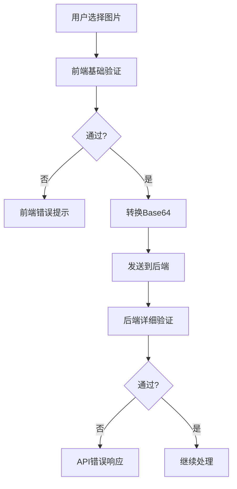

# 🎭 Seedance 分辨率和图片验证更新

## 📊 **更新内容总结**

### **1. 分辨率选项简化**
- ❌ **移除**: 480p (Standard) 选项
- ✅ **保留**: 720p (HD) 和 1080p (Full HD - Pro only)

### **2. 图片上传限制调整**
- **文件大小**: 从 30MB 降低到 **10MB**
- **验证位置**: 尺寸和宽高比验证从前端移到后端
- **前端验证**: 只检查文件大小和格式
- **后端验证**: 完整的尺寸、宽高比和格式验证

## 🔧 **前端更新**

### **分辨率选择器**
```typescript
// 类型定义更新
const [resolution, setResolution] = useState<'720p' | '1080p'>('720p');

// UI选项更新
<select value={resolution} onChange={...}>
  <option value="720p">720p (HD)</option>
  {selectedModel === 'seedance-pro' && (
    <option value="1080p">1080p (Full HD - Pro only)</option>
  )}
</select>
```

### **图片验证简化**
```typescript
// 前端只验证基础信息
const validateImage = async (file: File) => {
  // 1. 文件大小检查 (10MB)
  if (file.size > 10 * 1024 * 1024) {
    return { valid: false, error: 'File size cannot exceed 10MB' };
  }

  // 2. 文件格式检查
  const allowedFormats = ['jpeg', 'jpg', 'png', 'webp', 'bmp', 'tiff', 'gif'];
  // ... 格式验证逻辑

  // 3. 转换为Base64 (不检查尺寸和宽高比)
  return { valid: true, base64: formattedBase64 };
};
```

### **UI提示更新**
```jsx
<div className="upload-hints">
  <p>JPEG, PNG, WebP, BMP, TIFF, GIF</p>
  <p>Max 10MB</p>  {/* 移除了尺寸和宽高比提示 */}
</div>
```

## 🛠️ **后端更新**

### **分辨率验证**
```typescript
// 更新分辨率验证
if (!['720p', '1080p'].includes(resolution)) {
  return NextResponse.json({ message: 'Invalid resolution' }, { status: 400 });
}
```

### **图片验证函数**
```typescript
async function validateImageBase64(imageBase64: string) {
  // 1. Base64格式检查
  if (!imageBase64.startsWith('data:image/')) {
    return { valid: false, error: 'Invalid image format' };
  }

  // 2. 文件大小检查 (10MB)
  const sizeInBytes = (base64Data.length * 3) / 4;
  if (sizeInBytes > 10 * 1024 * 1024) {
    return { valid: false, error: 'Image size cannot exceed 10MB' };
  }

  // 3. 图片尺寸和宽高比检查
  const img = new Image();
  img.onload = () => {
    const width = img.width;
    const height = img.height;
    const aspectRatio = width / height;

    // 尺寸检查 (300-6000px)
    if (width < 300 || width > 6000 || height < 300 || height > 6000) {
      return { valid: false, error: 'Image dimensions must be between 300px and 6000px' };
    }

    // 宽高比检查 (0.4-2.5)
    if (aspectRatio < 0.4 || aspectRatio > 2.5) {
      return { valid: false, error: 'Image aspect ratio must be between 0.4 and 2.5' };
    }

    return { valid: true };
  };
}
```

### **API验证流程**
```typescript
if (generationMode === 'image-to-video') {
  // 基础字段验证
  if (!imageBase64 || !imagePrompt?.trim()) {
    return NextResponse.json({ message: 'Missing required fields' }, { status: 400 });
  }

  // 图片详细验证
  const imageValidation = await validateImageBase64(imageBase64);
  if (!imageValidation.valid) {
    return NextResponse.json({ message: imageValidation.error }, { status: 400 });
  }
}
```

## 🗄️ **数据库更新**

### **表约束更新**
```sql
-- 更新分辨率约束
resolution VARCHAR(10) NOT NULL CHECK (resolution IN ('720p', '1080p')),
```

## 📊 **验证规则对比**

### **前端验证 (简化)**
| 验证项 | 规则 | 错误处理 |
|--------|------|----------|
| 文件大小 | ≤ 10MB | 前端提示 |
| 文件格式 | JPEG, PNG, WebP, BMP, TIFF, GIF | 前端提示 |
| Base64转换 | 自动转换 | 前端提示 |

### **后端验证 (完整)**
| 验证项 | 规则 | 错误处理 |
|--------|------|----------|
| Base64格式 | data:image/... | API错误响应 |
| 文件大小 | ≤ 10MB | API错误响应 |
| 图片尺寸 | 300-6000px (宽高) | API错误响应 |
| 宽高比 | 0.4-2.5 | API错误响应 |

## 🎯 **用户体验改进**

### **优势**
1. **更快的前端响应**: 前端验证更简单，响应更快
2. **更准确的验证**: 后端使用实际图片数据进行验证
3. **更清晰的选项**: 移除不常用的480p选项
4. **合理的文件限制**: 10MB对大多数用例足够

### **验证流程**


## 🔄 **N8N数据格式**

### **发送给N8N的分辨率选项**
```json
{
  "resolution": "720p" | "1080p"  // 不再包含480p
}
```

## ✅ **更新清单**

### **已完成**
- ✅ 前端分辨率选项移除480p
- ✅ 前端图片验证简化
- ✅ 前端文件大小限制改为10MB
- ✅ 前端UI提示更新
- ✅ 后端分辨率验证更新
- ✅ 后端图片验证函数添加
- ✅ 后端完整验证流程
- ✅ 数据库约束更新

### **验证要点**
- ✅ 720p为默认选择
- ✅ 1080p仅Pro模型可用
- ✅ 图片验证在后端进行
- ✅ 错误信息清晰明确

---

## 🎯 **总结**

这次更新实现了：
1. **简化用户选择**: 移除不常用的480p选项
2. **优化验证策略**: 前端快速验证，后端精确验证
3. **合理的限制**: 10MB文件大小适合大多数使用场景
4. **更好的用户体验**: 更快的前端响应和更准确的错误提示

所有更新都保持了向后兼容性，现有功能不受影响。
