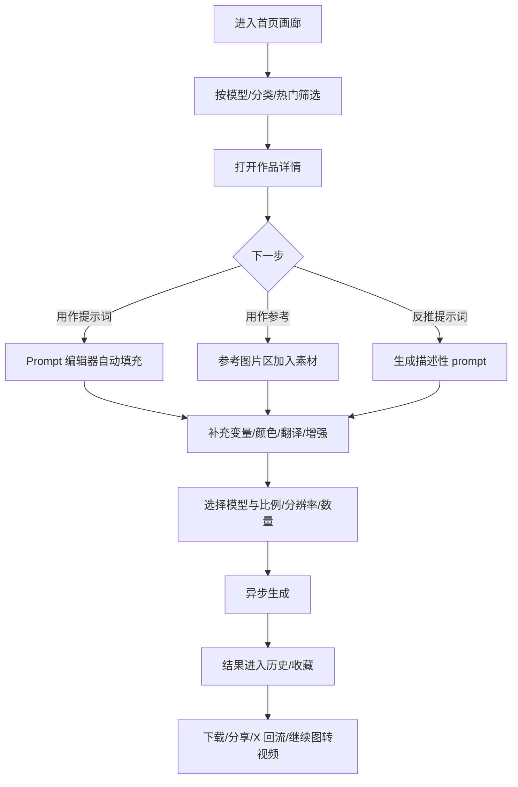
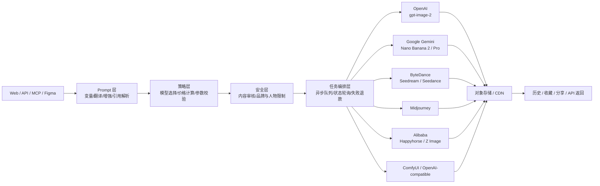

# meigen.ai 深度研究报告

## 执行摘要

MeiGen 的核心不是“又一个 AI 生图站”，而是把**内容发现、提示词复用、跨模型生成、社交流量回流**压成了一条极短链路：用户先在画廊里看见已经被社交平台验证过的作品，再一键把提示词、参考图或视频带入统一生成器，最后在同一界面里切换 GPT Image 2、Nano Banana、Seedance、Veo、Midjourney 等模型继续迭代；这一套又被抽象成 Web、REST API 与 MCP 插件三层产品形态。官方中文文档显示，它同时提供免费画廊、Web 应用、REST API 与 MCP 插件，支持 GPT Image 2、Nano Banana、Midjourney、Seedance、Veo 等主流模型。citeturn29view0turn29view2turn13view1

从产品逻辑看，MeiGen 真正的“增长飞轮”由四个部件组成：**来自 X 的精选 prompt 画廊、拖拽/用作提示词的低摩擦复用、模型无关的统一生成器、社交分享与邀请返利**。其公开文档明确写到：画廊每周更新、支持语义搜索、可把卡片拖入“反推提示词”和“参考图”区域；桌面端有 hover 覆层、移动端直接进入详情；生成器支持变量标签、颜色选择器、Prompt 增强、@ 引用参考图、图转视频与 Seedance 续写视频。citeturn25view0turn26view1turn26view2turn26view3turn26view6turn26view7

从商业化与供给侧看，MeiGen 当前更像一家**“多模型编排与 prompt 分发平台”**，而不是自研基础模型公司。其统一 API 通过 `modelId` 路由到 OpenAI、Google、ByteDance、Midjourney、Alibaba 等上游；MCP 插件还支持本地 ComfyUI 和任意 OpenAI 兼容 API；公开资料显示生成图片与参考图会经过 `api.meigen.ai` 和 `gen.meigen.ai`，产物临时存于 Cloudflare R2，文档站使用 Mintlify。citeturn24view0turn22search3turn14view6turn14view7

公开可见的商业化门槛并不高：官方 changelog 显示新用户欢迎积分已下调至 20，每日 20 免费积分仍保留，充值入口“from $9.90 for 1,000 credits”；官方文档同时说明，免费积分目前只覆盖基础模型 Z Image Turbo，高级模型如 GPT Image 2、Nanobanana Pro、Seedream、Midjourney、Seedance、Veo 需要欢迎积分或购买积分，API 调用则只能消耗购买积分。citeturn35search0turn29view2turn9search9turn22search2

如果你要做“**逻辑几乎相同**”的产品，最值得复制的不是它的具体 prompt 文本，而是这五层抽象：**内容采集与归档层、模型感知型 prompt 适配层、统一推理编排层、历史/收藏/分享层、API/MCP 外部接入层**。但也必须明确：**不要直接照搬其提示词数据库、模型命名、创作者卡片、页面文案和品牌元素**。MeiGen 自身的隐私与条款写得很清楚：它索引来自 X 的公开作品，强调署名与 DMCA 移除，并对内容审核、知识产权侵权、虚拟积分退款、违规多账号等进行了约束。你可以复制“机制”，不应复制“资产”。citeturn12search0turn8search1turn35search3

对你而言，最优打法不是“做一个更像 MeiGen 的站”，而是做一个**比 MeiGen 更专业的工作流产品**：同样保留“灵感画廊 → 一键复用 → 多模型生成”，但在它薄弱的团队协作、品牌资产管理、企业权限、审校流、模板市场、区域本地化与可访问性上拉开差距。公开文档目前展示的共享能力主要是收藏同步、查看原始 X 帖子、直接分享至 X，以及 API/MCP/Figma 等工具接入；并没有公开团队空间、审批流、多人评论、项目级权限管理等企业能力。citeturn25view0turn10search1turn8search2

## 产品分析

### 核心产品逻辑

MeiGen 的首页就是画廊，画廊内容来自 X 社区的精选 AI 生成作品，官方文档写明会**每周更新**；用户在主页中按模型、分类与热度浏览后，可以通过“使用创意”“用作提示词”“用作参考”把发现直接送进生成器，而不需要重新写 prompt。它把“发现”与“生成”放在一个界面里，降低了从 inspiration 到 instruction 的损耗。citeturn25view0turn29view1

从 UX 上看，MeiGen 把提示词当成一种“半结构化可编辑对象”，而不是一段纯文本。官方文档说明，某些 prompt 会出现蓝色 `[placeholder]` 变量标签，点击即可改写；提示词可翻译成英文；短 prompt 可自动增强；输入 `#` 可唤出色板并插入 hex 色值；输入 `@` 可引用某张具体参考图。也就是说，它的 prompt system 本质上是“**可视化模板 + 模型适配器 + 引用系统**”。citeturn29view1turn26view2turn26view3

官方还把“图像理解”反向嵌入了 prompt 生产流程：你既可以把一张外部图片拖到“反推提示词”区域，也可以在详情页点“反推提示词”，由 AI 生成关于主题、构图、风格、光线、配色与视角的描述。这个设计极其关键，因为它把 prompt 供给从“人写”扩展到了“图像反推 + 人编辑”。citeturn26view6

### 详细功能清单

下表按用户可感知的产品层整理 MeiGen 公开功能：

| 模块 | 公开可见能力 | 产品意义 |
|---|---|---|
| 画廊 | 主页瀑布流、6 个分类、模型标签、点赞/浏览数、时间、最新/热门、视频分类、每周更新 | 用内容消费拉新，降低“空白页焦虑” |
| 搜索 | 混合搜索，结合文本匹配与向量语义；按模型、分类、有无 prompt 筛选；空查询默认最新帖；300ms 防抖 | 用“检索”替代“想 prompt” |
| Prompt 编辑 | 变量标签、翻译、Prompt 增强、颜色选择器、快捷键生成 | 把 prompt 从手工文本变成半结构化编辑对象 |
| 参考系统 | 上传参考图、多图引用、`@image1` 语法、拖拽画廊卡片为参考图 | 提升定向可控性 |
| 反推 Prompt | 从画廊图或外部图生成详细提示词 | 扩展 prompt 供给、方便复刻风格 |
| 图像生成 | 多模型统一入口、数量/比例/分辨率/画质控制；付费用户可并行 4 张 | 把多模型差异封装到一套表单里 |
| 视频生成 | Seedance / Happyhorse / Veo；文生视频、图生视频、Seedance 续写视频、自动音频 | 把“静态内容”升级为视频工作流 |
| 历史与收藏 | 历史搜索、生成状态、收藏夹、跨设备同步 | 形成个人素材库与回访场景 |
| 分享与推荐 | 可查看原始 X 帖子；更新日志显示可直接分享到 X；邀请返利 | 形成内容传播闭环 |
| 开发者扩展 | REST API、API Token、MCP 插件、OpenClaw Skill、Figma Plugin | 从终端用户扩到开发者/设计工具生态 |

以上各项均来自 MeiGen 官方中文文档、首页与 changelog。citeturn25view0turn26view1turn26view4turn26view6turn26view7turn10search1turn8search2

### Prompt 分类法与可复制模板

MeiGen 没有把所有模型都用同一套 prompt 逻辑对待。其官方文档与上游模型文档共同指向一种很清晰的“模型差异化 prompt taxonomy”。

| 模型 | 最佳 prompt 结构 | 公开依据 | 你可直接复刻的模板 |
|---|---|---|---|
| GPT Image 2 | **场景目标 + 主体 + 构图 + 光线/材质 + 文案/排版 + 约束**。更擅长复杂场景组合、文字渲染、严格遵循要求 | MeiGen 文档称其默认模型，擅长提示词遵循、文字渲染与复杂场景组合；OpenAI 也将 `gpt-image-2`定位为高质量、强可控生图模型 citeturn27view1turn31search1turn32search17 | **模板**：`为[品牌/产品/角色]制作一张[用途]视觉。主体是[主体]，环境在[场景]。构图为[镜头/角度/景别]。材质、光线与色彩为[描述]。如果有文字，必须包含[文案]并保持可读。避免[禁忌项]。输出风格为[风格]，比例[比例]。` |
| Nano Banana 2 | **对话式编辑/改写**，尤其适合多图融合、角色一致性、局部改动、超宽超高比例探索 | Google 官方把 Nano Banana 定义为 Gemini 原生图像生成能力；MeiGen 文档称 Nanobanana 2 是“最实惠的 Gemini 模型”，适合快速迭代，支持极宽与极高比例 citeturn31search2turn31search17turn34search10turn28view0 | **模板**：`以 @image1 的人物为主体，保持脸型、发型与服装识别点不变，把场景改成[新场景]。参考 @image2 的光线与色调，但不要复制其中具体物体。让动作改成[动作]，镜头为[镜头]，输出为[比例]。` |
| Seedance 2.0 | **导演式视频 prompt**：镜头主体 + 动作 + 镜头运动 + 时长 + 声画氛围 + 首尾帧/参考视频条件 | ByteDance 官方强调其原生音视频联合生成、支持 image/audio/video 参考与导演级控制；MeiGen 文档说明它支持文生视频、图生视频、视频续写、自动音频与 Fast/Pro 双档 citeturn31search4turn31search19turn28view2turn26view7 | **模板**：`5 秒短片。主体是[主体]，先从[开场画面]开始，镜头[推进/平移/环绕]，中段出现[关键动作]，结尾停在[结尾画面]。整体氛围[情绪]，环境声[音频氛围]，不要快闪，不要突然切镜。若有参考图，保持其服装与场景元素。` |

如果你要做“同样的逻辑”，建议不要做一个单一 Prompt Builder，而是做一个**模型感知型 Prompt Composer**：同一个用户意图，分别映射为 GPT 型、Gemini/Nano Banana 型、Seedance 型 prompt 模板。上游模型能力差异很大，统一文本输入只会降低质量。MeiGen 之所以体验好，不是因为 prompt 神秘，而是因为它把**模型差异前置到了表单与模板层**。citeturn26view1turn24view0turn31search2turn31search4

### 典型用户流程

下面这条流程，基本就是 MeiGen 的最小闭环：先看，再拖，再改，再生成，再收藏/分享。

这个流程并非猜测，而是可以直接从 MeiGen 的画廊文档、生成器文档以及 API 异步流程里拼出来：画廊支持“用作提示词”“用作参考”“反推提示词”；生成器支持变量、翻译、增强、参考图与模型切换；API 以异步方式提交并轮询状态。citeturn25view0turn26view3turn26view6turn27view7

### 定价、引导、限制、导出与端差异

MeiGen 的新用户引导目前有三层。第一层是**零门槛画廊浏览**；第二层是欢迎积分与每日免费积分；第三层是升级到购买积分。官方 changelog 显示新用户赠送积分已经从 40 下调到 20；快速开始文档写明每日免费积分每 24 小时刷新，但只覆盖当前基础模型 Z Image Turbo；充值入口从 $9.90/1000 credits 起。citeturn35search0turn9search9turn29view2

生成限制也写得很明白：免费用户单次只能生成 1 张图片，付费用户最多并行 4 张；4K 仅付费用户解锁；API 端每用户每分钟 12 次请求；每个账号最多同时拥有 5 个活跃 API Token。视频模型中，Seedance 支持 4–15 秒、Happyhorse 3–15 秒、Veo 只支持 4/6/8 秒。citeturn26view4turn27view8turn22search2turn24view0

导出方面，官方文档明确支持**全分辨率图像下载**，API 状态返回中会给出 `imageUrl` / `imageUrls` / `videoUrl`；Midjourney V8.1 一次返回 4 张候选图。另一个公开镜像前端 meigenai.app 还展示了 PNG/JPG 输出格式开关，但这一点没有在 meigen.ai 正式文档中重复说明，因此我会把它视为“高概率存在、但仍需你二次核验”的功能。citeturn25view0turn24view0turn35search1

桌面端和移动端体验差异非常明显。官方文档写明：桌面端有 hover 覆层、底部浮动工具栏、拖拽卡片到生成器；移动端没有 hover，点击卡片会直接打开完整详情视图。更新日志还特别提到 2026 年 1 月改进了 responsive sidebar 和 mobile experience。换言之，MeiGen 目前公开形态更像“**移动友好的 Web 应用**”，不是原生移动 App 产品。citeturn25view0turn10search1

### 与最接近竞品的对比

下表把 MeiGen 与最接近的三类竞品——OpenArt、SeaArt、Leonardo——放在同一张图上看。这里的“技术栈”是**可观察/公开披露的栈**，不是反编译意义上的完整前后端栈。

| 平台 | 核心定位 | 关键功能 | 公开定价 | 公开流量估算 | 可观察技术栈 |
|---|---|---|---|---|---|
| **MeiGen** | X 驱动的 prompt 画廊 + 多模型生成 + API/MCP | 画廊、语义搜索、用作提示词/参考、反推 prompt、变量标签、参考图 `@`、图/视频统一生成、收藏、API、MCP、Figma Plugin citeturn25view0turn26view6turn8search2 | 公开仅看到入门充值 **$9.90 / 1000 credits**；每日 20 免费积分只覆盖基础模型，高级模型需欢迎/购买积分 citeturn35search0turn29view2 | 第三方 Toolify 估算约 **299.5K/月**；Direct 49.31%，Search 16.24%，Referrals 16.20%，Social 14.54%（**低置信，非 Similarweb**） citeturn43view0 | 统一 REST API、TypeScript MCP、Cloudflare R2、对象 URL 参考图、可接 ComfyUI / OpenAI 兼容 API、Mintlify 文档 citeturn29view2turn14view6turn14view7turn13view0 |
| **OpenArt** | AI Creator Studio，图/视频/音频一站式工作室 | 100+ 模型、图像生成、视频生成、角色一致性、Story Creation、并行生成、Suite 工作流 citeturn44search3turn44search4turn44search14 | Free；当前页显示折后 **Essential $7/seat/mo**、**Advanced $14.5/seat/mo**，分别含 4,000/12,000 credits、8/16 并行、100+ premium 模型访问 citeturn44search0 | Similarweb 约 **9.1M/月**；Direct 40.11%，Paid Search 第二，Organic Search 第三；关键词含 `openart`、`openart ai`、`kling ai`、`sora` citeturn42view0turn42view3 | OpenArt 自身公开集成 Seedance 2.0、Veo 3.1、Kling Omni、Wan 2.7；Modal 案例显示其曾在 Modal 上扩展到数百 GPU 运行复杂生成流水线 citeturn44search3turn30search15 |
| **SeaArt** | 大社区驱动的 AI 艺术/视频/角色平台 | 图像、视频、角色、社区 remix/share、移动 App、模型广场，首页直接推广 Seedance 2.0 citeturn44search5turn44search7 | 订阅 + Credits/Stamina 双币；官方页写明大部分标准图像约 **6 Credits/张**，Regular 用户可提交 2 个任务/同时处理 1 个，VIP 提升并发；搜索片段未公开完整月费 citeturn44search1 | Similarweb 约 **18.6M/月**；日本 36.5% 为最大来源国，9.49 pages/visit、9:36 平均时长，强社区粘性明显 citeturn41view1 | 官方公开的是 Web + App Store/Google Play 分发、社区 feed、Credits/Stamina 调度；底层基础设施未披露 citeturn44search5turn44search7 |
| **Leonardo** | 更偏企业/团队的 AI 创意生产平台 | 营销与设计团队协同、图像与视频创意套件、规模化 campaign production citeturn44search8 | 官方确认免费用户有**每日 token**、付费用户有**月度 token allowance**；价格页搜索片段未展开全部层级。外部 2026 梳理通常记为 **$12 / $30 / $60** 三档（低置信、第三方） citeturn44search2turn44search6 | Similarweb 约 **10.7M/月**；Direct 47.31%，Organic Search 第二，Referrals 第三 citeturn42view1turn41view2 | 官方显示是面向团队与 campaign 的 proprietary creative suite；更像“AI 创意生产平台”，具体推理基础设施未公开披露 citeturn44search8 |

如果只看“和 MeiGen 最像”的维度，**OpenArt 是最强的功能近邻**，因为它也在做“多模型统一工作流”；**SeaArt 是最大流量与社区近邻**，因为它把社区、模型和移动端做得更厚；**Leonardo 是企业创意生产近邻**，因为它从一开始就在强调团队规模化内容生产。MeiGen 则胜在“prompt inspiration → generation”的最短路径，以及 MCP/API/Figma 这条偏开发者与工作流的分发路线。citeturn41view0turn41view1turn44search8turn29view0

## 技术分析

### likely 模型映射与供应商关系

MeiGen 官方模型对比页已经把多数上游关系说得很直白：GPT Image 2.0 属于 OpenAI，Nanobanana 2 / Pro 属于 Google（Gemini），Seedream / Seedance 属于 ByteDance，Midjourney V8.1 属于 Midjourney，Happyhorse 1.0 属于 Alibaba，Veo 3.1 属于 Google。它不是自己训了这些模型，而是在做统一编排、统一计费与统一前端。citeturn27view1turn28view1turn28view2turn27view4turn27view5

其中一个值得注意的细节是 **Nanobanana Pro 的上游映射可能处在迁移期**。MeiGen 公开 `modelId` 仍写作 `gemini-3-pro-image-preview`，而 Google 官方模型页与变更日志又提示早期 Gemini 3 Pro Preview 已退场，迁移到更新版本；Google 还在 2026 年 2 月正式发布了 Nano Banana 2 对应的 `gemini-3.1-flash-image-preview`。这意味着你如果复刻同类产品，**必须把上游模型映射表做成可热更新配置**，不要把供应商 model ID 硬编码在前端。citeturn28view1turn34search10turn33search2

### 推理流水线与系统架构

MeiGen 官方 API 文档说明了它的控制面：`POST /api/generate/v2` 提交任务，统一用 `modelId` 区分图像与视频模型；之后轮询 `GET /api/generate/v2/status/:id` 获取状态；推荐每 3 秒轮询一次，图像任务建议 5 分钟超时，视频 10 分钟；成功后直接拿 `imageUrl` / `imageUrls` / `videoUrl`。这意味着它本身的服务更像**任务编排器 + 计费器 + 资产索引器**。citeturn24view0turn27view7turn27view8

结合官方隐私政策、MCP 仓库与文档，可把其公开可观察架构概括如下：前端负责画廊浏览、prompt 编辑与上传；中间层负责 prompt 增强/翻译/引用处理、内容审核和 provider 路由；上游走 OpenAI、Google、ByteDance、Midjourney、Alibaba 或你自己的 OpenAI 兼容 endpoint；历史产物与引用资源放在对象存储/CDN，MCP 分支下的参考图会本地压缩后通过 `gen.meigen.ai` 上传，并在 24 小时后过期。citeturn12search0turn14view6turn14view7turn13view1

上图不是官方架构图，而是基于公开接口、供应商说明、R2 存储、MCP 支持和异步 API 流程做出的高置信重建。你如果复刻，强烈建议把**策略层**做成单独服务：它负责倍率、可选比例、分辨率、可接受参考图数量、模型特定字段（如 Midjourney 的 `stylize/chaos/raw`、Seedance 的 `tier/duration/referenceVideo`）和价格逻辑。否则前端复杂度会迅速失控。citeturn24view0turn22search3turn28view2

### 时延、并发与可扩展性

MeiGen 中文模型页直接公开了典型耗时：Z Image Turbo 约 12 秒，Flux 2 Klein 约 18 秒，Seedream 4.5 约 17 秒，Seedream 5.0 Lite 约 35 秒，Nanobanana 2 约 38 秒，GPT Image 2 与 Nanobanana Pro、Midjourney V8.1 都在约 45 秒量级；视频方面，Seedance 2.0 约 1–4 分钟，Happyhorse 约 1–2 分钟，Veo 3.1 约 1–7 分钟。API 端每用户每分钟限 12 次提交，说明它已经在控制爆量与供应商成本。citeturn29view3turn27view8

这套模式的优势是**横向扩展友好**：图像/视频大算力主要在外部 provider，MeiGen 自己维护的是轻量控制面与资产层；缺点则是对上游价格、速率限制和模型变更高度敏感。它自己在模型比较页也写了：积分成本会随 provider pricing 变化而调整，提交时生成按钮显示的金额为准。这意味着你的复刻版必须准备**动态价格表、熔断、fallback 与供应商级 SLA 监控**。citeturn9search0turn27view8

### Prompt engineering 技巧

MeiGen 的 prompt engineering 不是停留在“教用户写更长的句子”，而是四件事并行。

第一，**模型感知增强**。官方明确区分“润色模式”和“扩展模式”：大多数模型用润色，Midjourney V8.1 则扩展为 Midjourney 优化语言。第二，**参考图语义检查**。如果提示词里出现“参考图”“uploaded image”“保持 @image1 构图”等模式而用户没上传参考图，系统会提醒。第三，**颜色选择器**用 hex 直出，减少自然语言颜色歧义。第四，**反推提示词**把视觉样式转成可编辑文字。citeturn26view3turn26view4turn26view2turn26view6

这几条特别值得你完整复刻。因为今天大多数“多模型生图平台”只做了模型选择器，没有做**意图压缩/上游适配**；MeiGen 的体验更像“设计工作流助手”，不是模型列表。它的 MCP 甚至把 `enhance_prompt`、`search_gallery`、`get_inspiration` 做成独立工具，其中 8 个工具里有 6 个在没有任何 provider 的情况下也能免费运行。citeturn13view1turn14view4

### 安全、审核与数据存储

MeiGen 在合规与隐私上的公开说明比很多同类站更完整。条款写明所有生成请求会先经过自动审核；违规请求不会扣积分；禁止内容包括成人、政治敏感、血腥暴力、歧视、武器/毒品、自伤等；对于合规生成内容，用户保留所有权并获得商业使用权。模型页还单独提醒 GPT Image 2 和 Nanobanana 2 对真人、名人、品牌 Logo、换脸等内容的过滤更严格。citeturn8search1turn35search3turn27view1turn28view0

隐私页的承诺同样值得注意：上传图与生成图在用户删除生成记录后会从服务器永久删除；对话记录和交互内容“不存储”；用户上传内容和生成图“不用于模型训练”；公开画廊内容来自社交平台索引，可通过 DMCA 请求删除。与此同时，MCP README 又披露了更底层的一层：在 MeiGen Cloud 路径中，生成图会临时存放在 Cloudflare R2，参考图通过 `gen.meigen.ai` 上传并在 24 小时后自动过期。组合起来看，更合理的理解是：**临时对象存储 + 历史记录索引 + 用户主动删除机制**。citeturn12search0turn14view1turn14view7

### 成本估算

先给出**按 MeiGen 当前公开充值价折算的终端零售价**。这不是你的真实 COGS，但它能告诉你用户对价格的接受区间。

| 模型 | MeiGen 公开积分规则 | 折算为 1,000 张图片的终端价 |
|---|---|---|
| Z Image Turbo | 2 credits / 张 citeturn27view3 | 2,000 credits ≈ **$19.8** citeturn35search0 |
| GPT Image 2 1K Standard | 2 credits / 张 citeturn27view1 | 2,000 credits ≈ **$19.8** citeturn35search0 |
| GPT Image 2 2K Standard 默认 | 5 credits / 张 citeturn27view1 | 5,000 credits ≈ **$49.5** citeturn35search0 |
| Nano Banana 2 | 5 credits / 张 citeturn28view0 | 5,000 credits ≈ **$49.5** citeturn35search0 |
| Nano Banana Pro | 10 credits / 张 citeturn28view1 | 10,000 credits ≈ **$99.0** citeturn35search0 |
| Seedream 5.0 Lite | 5 credits / 张 citeturn28view1 | 5,000 credits ≈ **$49.5** citeturn35search0 |
| Midjourney V8.1 1K | 15 credits / 4 图批次 citeturn28view1 | 3,750 credits ≈ **$37.1** citeturn35search0 |
| Midjourney V8.1 2K | 20 credits / 4 图批次 citeturn28view1 | 5,000 credits ≈ **$49.5** citeturn35search0 |

再看**上游已经公开的 list price**。Google 官方模型文档给 Nano Banana 2 对应的 `gemini-3.1-flash-image-preview` 标出约 **$0.067 / image output**，Nano Banana Pro 对应的 `gemini-3-pro-image-preview` 标出约 **$0.134 / image output**；OpenAI 对 `gpt-image-2` 公开的是基于图像输出 token 的计价，并明确需要用 image generation calculator 按分辨率估算，没有单一固定“每张价格”。citeturn34search6turn33search12turn32search3turn32search9

因此，如果你要做财务模型，我建议把成本分成三层：**上游推理成本、平台对象存储与带宽成本、返利/获客补贴成本**。在业务早期，真正压利润的往往不是存储，而是欢迎积分、邀请返利和失败退款。如果你想复制 MeiGen 的“低价 + 多模型”感觉，最现实的做法不是纯靠 reseller 毛利，而是：**公开给用户的 credits 价格做成策略层，配合模型差异化加价、充值阶梯、欢迎积分限制、高级模型白名单与视频单独溢价**。这也是 MeiGen 为什么把免费积分限制在基础模型上的根本原因。citeturn29view2turn22search2turn8search1

## 流量与增长

### 当前流量画像

对 MeiGen 来说，当前最可用的公开流量估算不是 Similarweb，而是 Toolify 第三方目录。其对 MeiGen 的估算是 **299.5K 月访问**，平均访问时长 **3:25**，每次访问 **3.16 页**，跳出率 **51.15%**；流量来源构成为 **Direct 49.31%**、**Search 16.24%**、**Referrals 16.20%**、**Social 14.54%**、**Mail 1.90%**、**Display Ads 1.81%**。这不是最高质量的数据源，但至少能说明：MeiGen 已经不是纯 SEO 小站，而是**品牌直达 + 搜索 + 外链 + 社交**相对均衡。citeturn43view0

地域上，Toolify 给出的前五国家/地区分别是埃及、印度、美国、西班牙、沙特。这说明它当前并非一个纯英语美区产品，而是在阿拉伯语/南亚/全球创作者圈里也有自然扩散。与此同时，官方 changelog 早在 2025 年底就加入了中文支持与微信支付，这进一步说明团队对多语言与跨区域支付是有意识的。citeturn43view0turn10search1

### SEO 结构与关键词策略

MeiGen 的 SEO 做法很明确：不是做泛“AI image generator”，而是做**模型词 + prompt 词 + 用例词**的 programmatic 组合页面。首页 title 就直接打“Free GPT Image 2 & Nano Banana Prompts Gallery”，导航区还单列 “GPT Image 2 Prompts / Nano Banana 2 Prompts / Nano Banana Prompts / Midjourney Prompts / Seedance 2.0 Video Prompts”；快速开始里又说明画廊共 1,446 条精选提示词，按摄影、插画与 3D、产品与品牌、美食与饮品、海报设计、UI 与平面这 6 类组织。citeturn8search2turn23search0turn29view1

这意味着它吃的是一类非常具体的长尾：**“某模型 + 某风格 + ready-to-use prompts”**。这种词的搜索量未必最夸张，但意图极强，且天然适合 landing page 模板化生产。你若复刻，应把关键词框架扩成三层：  
其一是**模型维度**，如 GPT Image 2、Nano Banana 2、Seedance 2.0；  
其二是**结果维度**，如 product poster、3D figurine、editorial, cinematic, clay, photorealistic；  
其三是**工作流维度**，如 image to prompt、image to video、reference image prompt。  
MeiGen 当前已经覆盖了第一、二层，对第三层的 landing page 还有明显放大空间。citeturn8search2turn21search0turn10search1

### Virality hooks 与留存机制

MeiGen 的 virality hook 不是普通 referral，而是把“**传播对象**”做成了 prompt 本身。画廊卡片含 likes、views、作者身份和“在 X 上查看”，相当于把社交证明嵌到产品内；更新日志又显示支持直接分享到 X、邀请好友赚 credits、新下载选项等；首页与镜像前端都在强调邀请返利。换句话说，它的分享不是“分享平台”，而是“分享一条可以被复刻的创作方法”。citeturn25view0turn10search1turn8search2turn35search1

留存机制则主要靠三件事：**历史、收藏、跨设备同步**。官方文档说明收藏与你的账户绑定，跨设备同步；历史搜索不仅能搜成功结果，还能看到处理中和失败的记录；用户删记录时还会触发数据删除，这会让“历史记录”真正有价值，不是垃圾桶。对创作者来说，这比一次性的 prompt demo 更接近生产工具。citeturn25view0turn12search0

### 可参考的公开 engagement benchmark 与建议目标

如果把 MeiGen 放到近邻竞品里看，它的公开 engagement 还远没到头。OpenArt 约 9.1M 月访问、5.35 pages/visit、5:47 平均时长；SeaArt 18.6M 月访问、9.49 pages/visit、9:36 平均时长；Leonardo 10.7M 月访问、8.86 pages/visit、6:05 平均时长。MeiGen 当前第三方估算的 3.16 pages/visit 与 3:25 平均时长，只能说明“产品已经可以留住人”，但还没形成真正社区级深度。citeturn42view0turn41view1turn42view1turn43view0

因此，我更建议你把早期增长目标设成“**运营目标区间**”而不是迷信行业均值：  
游客 → 注册：**4%–8%**；  
注册 → 首次生成：**35%–60%**；  
首次生成 → 次日回访：**20%–35%**；  
首图用户 → 首付费：**4%–8%**；  
付费用户 D30 留存：**15%–25%**。  
这些不是公开官方基准，而是更符合这类 PLG 创作工具的可执行目标。对于你来说，真正重要的是把“**首个 wow moment 时间**”压到 60 秒以内。  

### 优先级增长计划

| 优先级 | 实验 | 机制 | 预估 ROI | 核心 KPI | A/B 测试想法 |
|---|---|---|---|---|---|
| 高 | 程序化 SEO 词页 | 复制 MeiGen 的模型词打法，但把页面扩成“模型 × 风格 × 行业 × 工作流”四维矩阵 | 很高 | 自然流量、注册率、首生图率 | A：纯 prompt 列表；B：列表 + 一键生成器；C：列表 + 模型对比 |
| 高 | 无登录试玩首图 | 游客直接“用创意→改变量→生成一张低清图”，在下载/收藏时触发注册 | 很高 | 游客→注册转化 | A：先登录；B：先试玩后登录 |
| 高 | 分享卡与 remix 链接 | 每张结果都附“Remix this”短链与参数签名，分享出去后回流到同一模板 | 高 | 社交流量占比、邀请转化 | A：纯图片分享；B：图片 + 可复刻 prompt 链接 |
| 高 | 创作者激励 | 给上传/授权 prompt 的创作者分成或 credits，形成自增长内容供给 | 高 | 新增 prompt 数、质量分布、社媒回流 | A：按入选奖励；B：按生成使用次数奖励 |
| 中 | 工作流插件分发 | 提前做 Figma/Photoshop/Canva/Claude/Cursor 插件，把产品嵌进别人的工作流 | 高 | 插件安装量、激活率、B2B 线索 | A：插件内免登录预览；B：需登录才能生成 |
| 中 | 失败场景再营销 | 对被 moderation 拒绝、积分不足、超时退款的人做邮件/站内召回 | 中高 | 失败后回转率、充值率 | A：提示替代表达；B：提示替代模型 + 一键重试 |
| 中 | 中文/阿拉伯语本地化 SEO | 基于当前地域分布，把核心页做中/阿/西语落地页与本地支付 | 中高 | 非英语 SEO、新用户 CAC | A：英文页+自动翻译；B：原生本地化案例页 |
| 中 | 视频专门漏斗 | 做 Seedance/Veo 专区，把“图转视频”和“首尾帧故事板”独立出来 | 中 | 视频首用率、ARPU | A：图像生成后再推荐视频；B：从首页直接进视频 |

MeiGen 现有证据表明，最有效的增长入口依旧是**高意图搜索 + 社交可复刻内容**，而不是重广告买量。因为公开第三方估算里，它的 Direct、Search、Referrals、Social 已经形成四路并行，而 Display Ads 占比不高。你若一开始就走重投流，会把单位经济打坏。citeturn43view0

### ASO 判断

截至本次研究，MeiGen 官方公开资料主要围绕 **Web、REST API、MCP、Figma/OpenClaw** 展开，更新日志也强调“mobile experience”与“responsive sidebar”，并未在公开功能说明里提到原生 iOS/Android App；相对地，SeaArt 官网明确展示了 App Store 与 Google Play 下载入口。基于这一点，我判断 MeiGen 当前**以 Web 为主、ASO 不是核心引擎**。citeturn10search1turn29view0turn44search7

## 差异化与产品机会

### 不要做更像的副本，要做更强的工作流产品

MeiGen 的长板在于“灵感到生成”的短链，但公开资料也暴露出它的边界：它是很强的**个人创作入口**，却还不是很强的**团队内容系统**。你如果严格复制它，短期能得到相似的使用感，长期却会陷入 OpenArt、SeaArt、Leonardo 的夹击：前者在工作流和模型宽度更强，后两者在社区与团队规模化更强。citeturn44search14turn44search5turn44search8

我建议你的差异化从下面六条切入，而不是仅靠“更多模型”。

| 方向 | 为什么值得做 | 具体建议 |
|---|---|---|
| 品牌资产层 | 大多数 prompt 平台停留在“生成一张图”，企业需要的是“保持品牌一致地生成一组素材” | 加入 Brand Kit、固定字体/颜色/Logo 安全区、可锁定的拍摄语言与版式模板 |
| 团队协作 | MeiGen 公开功能仍以收藏同步与分享为主 | 做团队工作区、评论批注、审批、版本对比、链接分享权限、客户只读预览 |
| 模板市场 | MeiGen 有 prompt 库，但不是可交易的模板市场 | 开放“可复用工作流模板”、风格包、品牌包、故事板包，并给创作者分成 |
| 企业安全 | 公开产品强调个人创作与公共 prompt 复用 | 做私有模型路由、BYO API Key、审计日志、SSO、数据保留策略、项目隔离 |
| 本地化 | MeiGen 已经做了中文和微信支付，说明跨区域有空间 | 深化中/阿/西本地案例、当地支付、当地热门风格包、区域创作者驻场计划 |
| 可访问性 | 目前公开材料强调视觉与创作，不强调 a11y | 增加键盘完整操作、屏幕阅读器标签、自动 alt、色盲安全预览、字幕与音频描述 |

这些机会并不需要你改变核心逻辑，反而应该建立在“**同样短的创作链路**”之上。最优产品形态不是“MeiGen Plus”，而是“MeiGen 的前端快感 + Leonardo 的团队价值 + OpenArt 的模型广度”。citeturn25view0turn44search8turn44search14

### 适合推出的高级层与企业场景

一个更合理的高级层设计可以是三段式：

- **Creator**：面向单人创作者，保留多模型、高清导出、4 图并行、基础视频、历史/收藏。
- **Studio**：面向小团队，加入 Brand Kit、Board、评论审批、共享模板、更多并发、批量导出。
- **Enterprise**：加 SSO、审计日志、BYO provider、私有数据域、项目隔离、法务白名单、合同 SLA。

企业 use case 里，最容易成交的不是“AI 艺术”，而是**电商素材、社媒广告变体、产品海报、短视频镜头板、品牌 KV 多语言本地化**。MeiGen 自身画廊的高频类别里就有产品与品牌、海报设计、UI 与平面、摄影，这些都天然接近商业场景。citeturn29view1

### 合作伙伴与平台策略

MeiGen 已经证明：Figma、MCP、OpenClaw 这类“嵌入他人工作流”的分发非常有效。你若重做一版，建议伙伴路线按“设计软件 → AI IDE/Agent → 电商/内容工具”排优先级：Figma/Canva/Photoshop，Claude/Cursor/Codex，Shopify/CapCut/Notion。对外的话术不要再叫“prompt gallery”，要叫“**visual workflow layer**”或“creative infrastructure”。citeturn8search2turn22search3

## 风险与合规

### 法律与知识产权风险

最敏感的风险，不是生图本身，而是**内容来源**。MeiGen 的隐私政策明确说，画廊会索引来自 X/Twitter 的公开 AI 作品与 prompt，并支持创作者通过 DMCA 页请求删除；条款中也把“帮助用户发现灵感并 credit original creators”写进了服务定义。由此可见，你如果做“相同逻辑”，必须同时复制两件东西：**署名机制**与**移除/申诉机制**。只复制展示，不复制权利路径，风险会很高。citeturn12search0turn35search3

更进一步说，“完全照搬 prompt 库”不仅是版权与数据库权问题，也会带来平台声誉问题。因为 MeiGen 的 prompt 价值，一部分来自它对 X 创作者的归档与引用；如果你直接把 prompt 复制成自己的库，而不保留来源、时间、互动指标和删除机制，你做的就不是“同样逻辑”，而是“未经授权再分发”。最稳妥的办法，是自己建立抓取与授权管线，或者只做用户原创/上传模板市场。citeturn12search0turn8search1

### 内容审核与模型偏见

MeiGen 在条款中已经把成人、政治敏感、血腥暴力、歧视、自伤、极端主义、违法活动列入明确禁区；GPT Image 2 和 Nanobanana 2 又都被单独标注为对名人、品牌、真实人物与换脸更严格。对你来说，这意味着 moderation 不能只做一个总开关，而要做成**平台规则 + provider 规则 + 场景规则**三层。citeturn8search1turn27view1turn28view0

模型偏见方面，最现实的问题不是抽象公平性，而是**风格、审美与人物默认设定偏差**。上游模型很容易把“professional, beauty, luxury, hero shot”等词自动映射到窄化的体型、肤色、性别和消费语境。如果你把 Meigen 的“高互动 prompt”直接当标准模板使用，偏差会被社交指标进一步放大。因此，企业版里最好加入：**diversity presets、禁用语建议、结果抽样复核、敏感属性红线**。这是商业上必须做的 bias mitigation。  

### 数据与隐私

MeiGen 公开承诺不存储用户对话、不将用户上传内容和生成图用于模型训练；同时，MCP 路径下参考图会本地压缩后上传，24 小时过期，Cloudflare R2 用于临时存储。这对 B2C 用户是不错的信号，但对企业客户还不够。企业会继续追问：**日志保存多久、是否有 region pinning、删除是否可审计、是否支持私有 provider、法务留存如何做**。citeturn12search0turn14view1turn14view7

### 风险矩阵与缓解建议

| 风险 | 影响 | 你该怎么做 |
|---|---|---|
| prompt/作品来源侵权 | 法务、下架、社媒舆情 | 保留作者来源、原帖链接、DMCA/申诉入口；优先做授权或用户原创内容 |
| 模型价格波动 | 毛利受损、价格体系失真 | 做动态价格表、分模型 credit multiplier、价格缓存与熔断 |
| 上游模型下线/变更 | 功能失效、历史模板失配 | model registry 配置化；模板与 modelId 解耦；自动迁移规则 |
| 审核误伤 | 用户流失 | 失败退款 + 替代用法建议 + 替代模型推荐 |
| 换脸/名人/品牌风险 | 高风险投诉 | 人像与品牌专线审核；企业版白名单；严格日志与人工复核 |
| 多账号薅积分 | 获客补贴失控 | 设备指纹、支付风控、邀请奖励延迟发放、首购后返利 |
| 社区内容劣化 | SEO 与转化下降 | 质量评分、人工精选、模板评级、创作者分级 |

## 实施路线图

### MVP 范围

如果目标是做出“和 MeiGen 逻辑几乎一样”的第一版，我建议你的 MVP 只保留下面这几个块：

- 公共灵感画廊  
- prompt 详情页  
- 用作提示词 / 用作参考  
- Prompt 增强 / 翻译 / 反推  
- 统一多模型生成器  
- 历史 / 收藏 / 下载  
- Credits 支付与基础推荐系统  
- 最小 Moderation / DMCA / 删除策略  
- REST API 与最小插件接口

你可以晚一点再做团队空间、创作者分成、模板交易、原生 App、复杂审批流。MeiGen 自身也是先把“发现-复用-生成”这条链打透，再往 MCP/Figma/视频扩。citeturn29view0turn25view0turn13view1

### 路线图

| 阶段 | 目标 | 交付物 | 主要风险 |
|---|---|---|---|
| **0–3 个月** | 做出可用 MVP | 画廊、详情页、统一生成器、3 个核心模型（GPT Image 2 / Nano Banana 2 / Seedance 2.0）、Prompt 增强/反推、Credits、下载、基本风控 | 需求膨胀、模型路由复杂、上游价格不稳 |
| **3–6 个月** | 做出增长飞轮 | SEO 落地页、邀请返利、分享卡、历史/收藏、创作者上传、模板变量、图转视频、Figma/Claude/Cursor 插件 | 内容质量失控、返利被滥用 |
| **6–12 个月** | 拉开差异化 | Brand Kit、Board、团队协作、审批流、企业版、SSO、BYO Key、模板市场、多语言支付与本地化运营 | 销售周期拉长、B2B/B2C 双线冲突 |

### 推荐团队配置

| 角色 | 0–3 个月 | 3–6 个月 | 6–12 个月 |
|---|---:|---:|---:|
| 产品经理 | 1 | 1 | 2 |
| 全栈工程师 | 2 | 3 | 4 |
| 前端/设计系统工程师 | 1 | 1 | 2 |
| AI/平台工程师 | 1 | 2 | 2 |
| 设计师 | 1 | 1 | 2 |
| 增长/SEO | 0.5 | 1 | 2 |
| 内容运营/社区 | 0.5 | 2 | 3 |
| 法务/审核支持 | 兼职 | 兼职 | 1 |

### 粗预算

下面是偏现实的、非极简黑客版预算。假设你主要走“外部模型编排 + SaaS 产品”路线，而不是自训模型。

| 阶段 | 月烧钱区间 | 主要成本构成 |
|---|---:|---|
| 0–3 个月 | **$35K–$70K / 月** | 小团队工资、上游 API、对象存储/CDN、支付、基础运维 |
| 3–6 个月 | **$60K–$120K / 月** | 团队扩编、SEO 内容、创作者激励、插件与增长实验 |
| 6–12 个月 | **$100K–$220K / 月** | 团队版/企业版研发、法务合规、销售支持、本地化与市场开支 |

如果你只想验证需求，最小化版本可把第一个阶段压到更低，但前提是：**不要一开始就接 8–10 个模型**。先做 3 个最核心的“形态模型”即可：  
一个**高遵循图像模型**（GPT Image 2）、  
一个**多图/编辑模型**（Nano Banana 2）、  
一个**视频模型**（Seedance 2.0）。  
这三个就足够复现 MeiGen 的核心产品逻辑。citeturn27view1turn28view0turn28view2

## 开放问题与研究限制

本报告的大部分产品与技术判断都建立在 MeiGen 官方中文文档、官方条款/隐私、官方首页与 MCP 仓库公开说明之上，因此关于**功能结构、模型支持、异步 API、隐私和内容审核**的可信度较高。citeturn25view0turn25view1turn25view2turn29view2turn12search0turn35search3

仍然存在几个需要你在立项前补充验证的点。其一，MeiGen 官方站公开可见的**完整套餐价格**没有完全展开，本报告只能高置信引用“from $9.90 / 1000 credits”与免费积分政策。其二，MeiGen 的**流量估算**主要来自 Toolify，而非 Similarweb，可信度低于竞品流量。其三，**Nanobanana Pro 与 Gemini 3/3.1 的上游映射**处在迁移期，做采购与成本模型时必须再次核对。其四，SeaArt 与 Leonardo 的公开价格片段不如 OpenArt 完整，因此竞品价格表里我对这两者做了“不完全公开”的标注。citeturn35search0turn43view0turn28view1turn33search2turn44search1turn44search2

综合来看，MeiGen 最值得学习的是**产品抽象能力**，不是 prompt 文本本身。你的最佳路径是：**复制它的机制，重做它的资产；复制它的 UX 节奏，升级它的团队与企业层；复制它的多模型编排，补齐它的商业化与合规深度。**