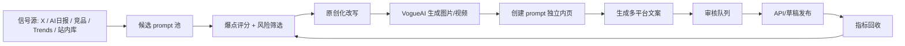

# VogueAI 海外社媒自动化发布系统方案

> 日期：2026-06-01  
> 目标：把 VogueAI 的 prompt gallery、图片生成能力、社媒分发和复盘打成一个日更增长系统。最终每天中英社媒发布不少于 30 条内容，但核心不是硬刷 30 个独立选题，而是每天产出 8-10 个高质量 prompt asset，再自动拆成 30+ 个平台原生内容单元。

## 1. 核心结论

VogueAI 现在最应该做的不是单独运营一个“品牌号”，而是做一个 `Prompt Asset Factory`：

1. 每天从 X、AI 日报、竞品、Google Trends、已有 prompt 库里找 30-50 个候选 prompt。
2. 用爆点评分筛出 8-10 个最适合传播和转化的 prompt。
3. 对每个 prompt 做明显原创化改写，不直接搬原 prompt 和原图。
4. 用 VogueAI 自己生成图片或视频素材，沉淀成我们自己的媒体资产。
5. 每个 prompt 上一个独立内页，内页提供图片、prompt、改写逻辑、模型、来源 credit、`Use Prompt` CTA。
6. 每个 prompt asset 自动拆成 X、Pinterest、短视频、小红书、中文 X、LinkedIn/Threads 等平台版本。
7. 自动发布优先走 API；浏览器脚本只用于草稿和人工确认；Reddit 只做人工社区参与，不做批量自动发帖。
8. 每天看 dashboard 复盘：哪些 prompt 带来曝光、点击、注册、生成、付费，第二天反向调整选题和文案。

这个系统要学习 MeiGen 的本质：它不是靠品牌号硬发广告，而是把 X 上已经验证过的 prompt 变成可复用的网页资产，再让网页资产反向承接搜索、Pinterest 和社媒流量。

## 2. 调研依据

本方案参考了这些本地资料：

- `Vogue-AI-Docs/meigen.ai-X推广路径研究.md`：MeiGen 的核心路径是“X prompt 内容源 -> 站内可复用 prompt -> 社媒继续传播”。
- `Vogue-AI-Docs/AIGC英推创作者与付费推广策略.md`：品牌号和 AIGC 创作者号要分工，创作者号负责高频案例和轻 CTA。
- `Vogue-AI-Docs/Vogue AI Prompt Gallery与内容资产.md`：VogueAI 当前定位已经是 `AI Prompt Gallery + Image Generator`，但还缺独立 prompt detail 页。
- `KKKK AI Space/出海产品&增长/X/11-产品增长与Prompt视觉竞对池-2026-05-27.md`：账号池只保留两类，产品增长账号和 prompt/视觉案例账号。
- `KKKK AI Space/出海产品&增长/X/10-Kimberly-100粉冷启动30天5M曝光复盘.md`：新号需要高频短内容、爆款拆解、评论区借流量和每日数据复盘。
- `KKKK AI Space/出海产品&增长/X/04-林悦己深海圈直播-AI自媒体内容系统.md`：AI 自媒体不是发新闻，而是信息源、对标、生产、分发、变现系统。
- `KKKK AI Space/每日AI日报/2026-06-01.md`：今天的 prompt 机会集中在 image-to-video、GPT Image 2 角色、欧洲旅行海报、人像写真、双曝光海报、face lock、黏土时尚封面、品牌 KV。

平台规则参考：

- [X Automation Rules](https://help.x.com/en/rules-and-policies/x-automation)：X 明确禁止非 API 的网站脚本自动化；自动发帖应走官方 API，且不能做重复、误导、骚扰、批量关注/点赞等行为。
- [X API Pricing](https://docs.x.com/x-api/getting-started/pricing)：X API 是 pay-per-usage，发布和带 URL 的发布都要按请求计费，接入前需要重新确认当前价格。
- [Pinterest API content docs](https://developer.pinterest.com/docs/content/)：Pinterest 支持创建 boards 和 Pins，Pin 可以带 `link`，适合把图片资产直接链到 prompt 内页。
- [Pinterest API best practices](https://developers.pinterest.com/docs/key-concepts/best-practices/)：Pinterest 对 scheduled publishing、spam 和授权状态有明确要求，适合做“用户授权后的排期发布”，不适合无边界刷量。
- [TikTok Content Posting API](https://developers.tiktok.com/doc/content-posting-api-get-started)：TikTok 支持 Direct Post，但需要开发者 app、授权、域名/素材要求和 Direct Post 配置。
- [YouTube videos.insert](https://developers.google.com/youtube/v3/docs/videos/insert)：YouTube Data API 支持视频上传，但新 API 项目上传视频默认可能受审核/可见性限制，并且上传接口有 quota 成本。

## 3. 最终系统长什么样

系统分成 8 个模块，每天按同一条流水线跑：



每天只需要人工看 3 个地方：

1. `候选池`：今天是不是选到了真正有传播性的 prompt。
2. `审核队列`：有没有版权、商标、真人肖像、敏感图或太像原作者的问题。
3. `复盘面板`：昨天哪些内容带来真实网站点击和生成，而不是只看点赞。

## 4. 每天 30 条内容怎么拆

不要理解成每天手写 30 个完全不同的内容。正确拆法是每天 8-10 个 prompt asset，每个 asset 拆 3-4 个分发版本。

建议日配额：

| 平台 | 每日数量 | 内容类型 | 链接策略 | 自动化等级 |
| --- | ---: | --- | --- | --- |
| English X 品牌号 | 4 | prompt demo、before/after、workflow、轻 CTA | 1-2 条带链接，其余放 reply 或 profile | API 可自动，早期人工审核 |
| English X 创作者号 | 5 | prompt case、prompt thread、视觉趋势拆解、引用评论 | 少带硬链接，更多做互动和收藏价值 | API/草稿混合 |
| 中文 X / 独立开发者号 | 5 | 项目进展、prompt 案例、增长复盘、竞品观察 | 可引到站内页或中文笔记 | API/草稿混合 |
| Pinterest | 10 | 单图 Pin、对比图 Pin、board 分发 | 每条都链到 prompt 内页 | 最适合 API 自动化 |
| 小红书 | 2 | 中文图文/教程/案例合集 | 不硬放外链，图上带品牌/关键词 | 先草稿，人工发 |
| TikTok / YouTube Shorts | 2 | 9:16 prompt reveal、生成过程、图转视频 | profile/link in bio/描述区 | 半自动，审核后发 |
| LinkedIn / Threads / Bluesky | 2 | 复用高质量英文观察或案例 | 轻链接 | 后续接 API |

合计：30 条/天。

Reddit 不计入 30 条。Reddit 是社区信任渠道，每周 2-3 条高质量帖或评论即可。每天自动发 Reddit 很容易被视为 spam。

## 5. 怎么找 prompt

每天候选来源按优先级排：

### 5.1 X 热点 prompt

监控账号来自 `11-产品增长与Prompt视觉竞对池-2026-05-27.md`。优先看这些 prompt/视觉账号：

- `@op7418`
- `@MrLarus`
- `@underwoodxie96`
- `@meigen7982`
- `@liyue_ai`
- `@aimikoda`
- `@HeyOz_AI`
- `@ivanka_humeniuk`
- `@zisimoszizosCom`
- `@pabloprompt`
- `@Taaruk_`
- `@joshesye`
- `@bggg_ai`
- `@monomosite`
- `@SimplyAnnisa`
- `@Dheepanratnam`

筛选条件：

- 24-72 小时内发布。
- 有图片或视频结果，不只是一段文字。
- 互动明显高于账号均值。
- 评论里有人求 prompt、求教程、求工具。
- 可以改成商业视觉、广告、头像、产品图、视频 hook 或模板页面。

### 5.2 AI 日报

每天读：

- `KKKK AI Space/每日AI日报/YYYY-MM-DD.md`
- 日报 payload 里的 X 链接和 Google Trends 条目。

以 2026-06-01 为例，今天可以直接进入候选池的主题：

- `image to video ai with prompt online free`，Google Trends 7 日暴涨 +850%。
- GPT Image 2 + Seedance 2.0 角色工作流。
- 欧洲城市旅行水彩海报。
- 雨夜车内人像写真。
- 足球明星 × 城市地标双曝光电影海报。
- face lock 街拍时尚写真。
- Claude + GPT Image 2 黏土动画时尚杂志封面。
- 戛纳红毯 editorial 肖像。
- storyboard/video 风格一致性。
- 品牌 KV 海报。

### 5.3 VogueAI 站内已有 prompt 库

现有数据在：

- `src/lib/prompts.ts`
- `src/lib/generated/awesome-gptimage2-prompts.json`
- `src/lib/generated/awesome-gptimage2-site-additions.json`
- `src/lib/generated/awesome-ai-prompts-nano-banana.json`
- `src/lib/generated/awesome-ai-prompts-midjourney.json`

这些内容适合作为“历史 prompt 再包装”，尤其适合 Pinterest 和 SEO 长尾。

### 5.4 Google Trends / SEO 长尾

每天只拿 3 类词：

- prompt 需求词：`ai image prompt`, `gpt image prompt`, `midjourney prompt`
- 生成场景词：`image to video ai with prompt`, `ai product poster`, `ai portrait prompt`
- 替代工具词：`perchance ai image generator`, `digen ai`, `meigen ai`

Google Trends 词不是直接发 X，而是决定今天的 prompt 页面标题和 Pinterest 标题。

## 6. 爆点评分表

每个候选 prompt 进入队列后打分，满分 35 分，低于 22 分不做。

| 字段 | 分值 | 判断标准 |
| --- | ---: | --- |
| 视觉冲击 | 0-5 | 用户刷到图能不能停 1 秒 |
| 商业场景 | 0-5 | 能否用于广告、产品图、头像、封面、短视频 |
| 趋势新鲜度 | 0-5 | 是否来自最近 72 小时热点或搜索增长 |
| 可改写空间 | 0-5 | 能否换行业、角色、材质、构图、镜头 |
| SEO/Pinterest 价值 | 0-5 | 是否有明确长尾词和可收藏属性 |
| 站内转化匹配 | 0-5 | 用户看完是否会点 `Use Prompt` |
| 风险反向分 | -5-0 | 明星、品牌、角色 IP、真人肖像、擦边、太像原图扣分 |

每日选题规则：

- 2 个高热趋势 prompt。
- 2 个商业视觉 prompt。
- 2 个人物/头像/写真 prompt。
- 1-2 个图转视频或短视频 prompt。
- 1-2 个站内历史 prompt 再包装。

## 7. 怎么把别人的 prompt 改得尽量原创

底线：不能只改几个词。每个 prompt 至少改 3 个维度，并生成自己的图。

可改维度：

- 主体：人物、产品、城市、行业、节日、品牌类型。
- 场景：室内、户外、展台、街拍、海报、包装、社媒封面。
- 构图：特写、俯拍、双曝光、分屏、杂志封面、电影海报。
- 镜头：35mm、85mm、macro、drone、cinematic push-in。
- 光线：golden hour、rainy neon、studio softbox、hard flash。
- 质感：clay、watercolor、paper grain、glassmorphism、chrome。
- 用途：ad KV、Pinterest cover、YouTube thumbnail、e-commerce hero。
- 语言：英文主 prompt + 中文解释，不直接复刻原作者表达。

队列里必须保存：

- `source_url`
- `source_author`
- `source_handle`
- `source_prompt_excerpt`
- `rewrite_prompt`
- `rewrite_notes`
- `changed_dimensions`
- `risk_level`
- `credit_text`

对外发布时建议：

- X 可写 `Inspired by a recent GPT Image 2 trend from @handle. Remixed for ecommerce poster use.`
- prompt 内页保留 `Source inspiration` 链接。
- 如果对方不愿意被引用，站内可下架或改成不展示来源，不要写“你不愿意我就删”这种显得心虚的公开文案。

## 8. 本地怎么重新做图

目标不是把别人图搬过来，而是让 VogueAI 产出自己的结果。

### 8.1 输入

每个入选 prompt 先生成一个 asset spec：

```yaml
id: 2026-06-01-watercolor-europe-travel-poster
theme: Europe watercolor travel poster
source_url: https://x.com/...
source_author: Taaruk
model_target: gptimage2
aspect_ratio: "4:5"
output_count: 4
rewrite_prompt: "Create a hand-drawn watercolor travel poster..."
negative_notes: "Avoid copying exact city, layout, and text from source."
commercial_angle: "Pinterest travel poster prompt + AI poster generator"
```

### 8.2 生成

今天可以先用半自动方式：

1. Codex 从候选池生成 `assets/YYYY-MM-DD.json`。
2. 你审核 8-10 条。
3. Codex 把 prompt 带入 VogueAI `/app` 或生成 API。
4. 每个 prompt 生成 2-4 张图。
5. Codex挑选可用图并记录 `image_url`、`local_path`、`prompt_page_slug`。

后续自动化方式：

- 优先走 VogueAI 后端 generation API。
- 图片产物存 R2 或 `media.vogueai.net`。
- 如果 provider 暂时不稳定，允许用浏览器会话生成，但浏览器生成只作为采样，不作为长期批量生产主链路。

### 8.3 选图标准

每个 prompt 最少保留 1 张主图，最多 4 张图：

- `hero`：社媒主图和 OG 图。
- `variation_a`：Pinterest 备用。
- `variation_b`：X thread 图。
- `vertical`：短视频或小红书 9:16/4:5。

淘汰规则：

- 文字乱码严重。
- 人脸/手部明显坏。
- 和原作者图过度相似。
- 包含真实品牌 logo 或名人肖像。
- 无法一眼看出用途。

## 9. prompt 内页必须先于社媒发布

社媒引流不能都指向首页。每个核心 prompt 应该有独立页面：

```text
/prompts/{slug}
```

页面字段：

| 字段 | 用途 |
| --- | --- |
| `slug` | SEO URL 和社媒链接 |
| `title` | 页面 H1 和社媒标题 |
| `description` | 搜索摘要 |
| `hero_image` | OG/Pinterest 主图 |
| `prompt` | 可复制 prompt |
| `model_id` | GPT Image 2 / Nano Banana / Midjourney |
| `aspect_ratio` | 1:1 / 4:5 / 9:16 / 16:9 |
| `category` | product poster / portrait / travel / video prompt |
| `source_url` | 灵感来源 |
| `credit_text` | 作者 credit |
| `rewrite_notes` | 我们改了什么 |
| `use_prompt_url` | `/app?target=image&model=...&prompt=...` |
| `published_at` | sitemap 和 freshness |

页面结构：

1. Hero：主图 + 标题 + `Use Prompt`。
2. Prompt box：英文 prompt，可复制。
3. Result gallery：2-4 张生成图。
4. How to remix：给 3 个可替换变量，比如 subject、lighting、format。
5. Source inspiration：引用来源链接和作者 handle。
6. Related prompts：同分类站内 prompt。
7. CTA：`Generate this prompt in VogueAI`。

SEO 细节：

- 每个页面要有 canonical。
- sitemap 要包含 prompt pages。
- OG/Twitter image 用站内 hero 图。
- JSON-LD 用 `CreativeWork` 或 `HowTo`。
- 页面 title 结构：`{Use case} AI Prompt | VogueAI`，例如 `Watercolor Travel Poster AI Prompt | VogueAI`。

现状判断：

- 当前首页已经是 prompt gallery，`src/lib/prompts.ts` 有完整 prompt 数据和 `getPromptEntryById`。
- 当前还没有独立 `/prompts/[slug]` 页面，只有首页弹层和 API。
- 所以社媒自动化系统的工程第一优先级是补 prompt detail route，否则 X/Pinterest 的流量承接不够精准。

## 10. 文案怎么写

每个 prompt asset 生成这些文案变体：

| 变体 | 平台 | 目的 |
| --- | --- | --- |
| `x_en_demo` | English X | 视觉 hook + 轻 CTA |
| `x_en_thread` | English X | 拆 prompt 结构，适合收藏 |
| `x_cn_builder` | 中文 X | 独立开发者视角：今天把某类 prompt 做成页面 |
| `pinterest_title` | Pinterest | SEO/收藏标题 |
| `pinterest_description` | Pinterest | 长尾词 + prompt page link |
| `xiaohongshu_cn` | 小红书 | 图文教程，适合中文用户 |
| `shorts_script` | YouTube/TikTok | 7-15 秒字幕脚本 |
| `linkedin_note` | LinkedIn | 产品/工作流角度 |

### 10.1 X 英文短帖模板

```text
GPT Image 2 is getting really good at {use_case}.

I remixed a viral {style} prompt into a {commercial_angle} template:

1. {visual_element}
2. {lighting_or_camera}
3. {format}

Prompt + result:
{prompt_page_url}
```

### 10.2 X 英文 thread 模板

```text
I turned a trending AI image prompt into a reusable {use_case} template.

The structure:
1. Subject: {subject}
2. Scene: {scene}
3. Camera: {camera}
4. Texture: {texture}
5. Output format: {format}

Full prompt below.
```

线程最后一条：

```text
I saved the full prompt and remix notes here:
{prompt_page_url}

You can run it directly in VogueAI.
```

### 10.3 中文 X 模板

```text
今天把一个 X 上跑起来的 GPT Image 2 prompt 重新做了一版。

我没有直接搬原图，主要改了 4 个点：
1. 场景从 {old_scene} 换成 {new_scene}
2. 用途从展示图改成 {commercial_use}
3. 画幅改成适合 {platform}
4. prompt 里加了 {key_control}

页面也单独上了，用户可以直接复用 prompt 生成。
{prompt_page_url}
```

### 10.4 Pinterest 模板

Title：

```text
{Use Case} AI Image Prompt for {Audience}
```

Description：

```text
Copy this {model} prompt to create a {style} {use_case}. Includes the full prompt, image result, remix notes, and a one-click VogueAI generator link.
```

### 10.5 小红书模板

```text
标题：这个 AI 图 prompt 很适合做 {use_case}

正文：
今天试了一个适合 {audience} 的 AI 生图 prompt。
我改了原始思路里的 {changed_dimensions}，重新生成了一版更适合 {platform/use_case} 的图。

prompt 结构：
主体：{subject}
场景：{scene}
镜头：{camera}
质感：{texture}
用途：{format}

适合拿去做：{use_cases}
```

小红书不要高频放外链，图上可以轻量带 `VogueAI prompt gallery` 或品牌水印。

## 11. 发布自动化怎么做

### 11.1 X

已有能力：

- 本机已经有 `x-publish` skill。
- 它能用真实 Chrome 打开 X、填入帖子和图片。
- 它适合做“草稿/半自动发布”，不适合无人值守全自动，因为浏览器自动发 X 有账号风险，也不符合 X 对非 API 自动化的边界。

最终能力：

- 建 `x_api_publisher`，走 X 官方 API 发帖。
- 只发布 `approved=true` 且 `platform=x` 的队列。
- 支持图片上传、thread、reply link、UTM 参数。
- 每次发布写回 `post_url`、`post_id`、`published_at`。

早期规则：

- 每天 X 不要 20 条都带链接。
- 英文品牌号每天 1-2 条带链接即可。
- 创作者号更多做 case、thread、引用评论和轻 CTA。
- 禁止自动点赞、自动关注、批量私信。

### 11.2 Pinterest

Pinterest 是最适合全自动分发 prompt page 的平台，因为图片 + 链接天然匹配。

操作方式：

- 每个 prompt asset 生成 1-2 个 Pin。
- 每个 Pin 链到 `/prompts/{slug}`。
- 按 board 分发：
  - `AI Product Poster Prompts`
  - `AI Portrait Prompts`
  - `GPT Image 2 Prompts`
  - `AI Video Prompt Ideas`
  - `AI Travel Poster Prompts`
  - `AI Ecommerce Image Prompts`

自动化方式：

- 接 Pinterest API。
- 队列表中 `platform=pinterest`、`approved=true` 后自动发。
- 每天 10 条 Pin 可行，但要避免同图同标题重复。

### 11.3 TikTok / YouTube Shorts

短视频不应该一开始追求复杂剪辑。先做 7-15 秒模板：

1. 第 0-2 秒：结果图闪现 + hook。
2. 第 2-6 秒：prompt 结构分 3 行出现。
3. 第 6-10 秒：before/variations。
4. 第 10-15 秒：`Full prompt on VogueAI`。

素材来源：

- 同一 prompt 的 2-4 张图。
- 或 GPT Image 2 图 -> Seedance/Hailuo 图转视频。

自动化方式：

- YouTube 可接 Data API 上传，但要处理审核、quota 和合成内容披露字段。
- TikTok 可接 Content Posting API，但 Direct Post 需要配置和审核。
- 早期用草稿模式：Codex 生成视频文件、标题、描述、标签，你确认后发布。

### 11.4 小红书 / 公众号

小红书适合中文教程和案例，不适合硬引流。

节奏：

- 每天 2 条小红书：一个 prompt case，一个教程/合集。
- 每周 1-2 篇公众号：把一周 winner prompt 做成合集和增长复盘。

自动化：

- Codex 可以生成小红书图文草稿、封面、标题、正文。
- 最终发布建议人工确认，因为平台规则和账号权重更敏感。

### 11.5 Reddit

Reddit 只做：

- 每周 2-3 次真实讨论。
- 只在高相关 subreddit 发 workflow、case study、问题讨论。
- 链接放评论或自然提及，不做每天批量发。

适合内容：

- `I tested 20 GPT Image 2 prompts for ecommerce posters. Here are the patterns that actually worked.`
- `Prompt-based image workflows are replacing manual moodboards for early ad concepts.`
- `How do you keep visual consistency between AI image prompts and video outputs?`

## 12. 数据表和队列设计

先用本地文件/SQLite，后续再接后台。

建议目录：

```text
KKKK AI Space/产品情况/VogueAI/social-automation/
  config/
    accounts.yaml
    platforms.yaml
    boards.yaml
  data/
    candidates/YYYY-MM-DD.json
    assets/YYYY-MM-DD.json
    posts/YYYY-MM-DD.csv
    publish-jobs/YYYY-MM-DD.json
    metrics/YYYY-MM-DD.json
  reviews/
    YYYY-MM-DD.md
  templates/
    daily-queue.example.csv
```

核心表：

### 12.1 `social_prompt_candidates`

| 字段 | 说明 |
| --- | --- |
| `candidate_id` | 候选唯一 ID |
| `date` | 采集日期 |
| `source_type` | x / ai_daily / trends / repo / competitor |
| `source_url` | 来源链接 |
| `source_author` | 来源作者 |
| `raw_title` | 原始标题 |
| `raw_prompt_excerpt` | 原 prompt 摘要 |
| `visual_score` | 视觉分 |
| `commercial_score` | 商业分 |
| `trend_score` | 趋势分 |
| `seo_score` | SEO/Pinterest 分 |
| `risk_level` | low / medium / high |
| `selected` | 是否入选 |

### 12.2 `social_prompt_assets`

| 字段 | 说明 |
| --- | --- |
| `asset_id` | prompt asset ID |
| `candidate_id` | 来源候选 |
| `title` | 内部标题 |
| `rewrite_prompt` | 改写后的 prompt |
| `changed_dimensions` | 改了哪些维度 |
| `model_id` | 模型 |
| `aspect_ratio` | 画幅 |
| `image_urls` | 生成图 |
| `hero_image_url` | 主图 |
| `prompt_page_slug` | 内页 slug |
| `status` | drafted / generated / page_ready / approved / published |

### 12.3 `social_post_variants`

| 字段 | 说明 |
| --- | --- |
| `post_id` | 内容单元 ID |
| `asset_id` | 所属 prompt asset |
| `platform` | x_en / x_cn / pinterest / xiaohongshu / youtube / tiktok |
| `account` | 发布账号 |
| `copy` | 文案 |
| `media_urls` | 图片或视频 |
| `target_url` | prompt page |
| `utm_url` | 带 UTM 链接 |
| `scheduled_at` | 排期 |
| `approved` | 是否审核通过 |
| `publish_status` | queued / drafted / published / failed |
| `published_url` | 发布后链接 |

### 12.4 `social_metrics`

| 字段 | 说明 |
| --- | --- |
| `post_id` | 内容 ID |
| `platform` | 平台 |
| `impressions` | 曝光 |
| `likes` | 点赞 |
| `comments` | 评论 |
| `shares` | 分享 |
| `saves` | 收藏 |
| `profile_visits` | 主页访问 |
| `link_clicks` | 链接点击 |
| `prompt_page_sessions` | GA/日志里的页面访问 |
| `app_starts` | 点击 Use Prompt 或进入 `/app` |
| `generations` | 实际生成次数 |
| `signups` | 注册 |
| `revenue` | 付费 |

## 13. 自动化命令设计

后续在 repo 里加这些脚本：

```json
{
  "social:collect": "tsx scripts/social/collect-candidates.ts",
  "social:score": "tsx scripts/social/score-candidates.ts",
  "social:rewrite": "tsx scripts/social/rewrite-prompts.ts",
  "social:generate": "tsx scripts/social/generate-assets.ts",
  "social:pages": "tsx scripts/social/create-prompt-pages.ts",
  "social:draft": "tsx scripts/social/create-post-variants.ts",
  "social:publish:x": "tsx scripts/social/publish-x.ts",
  "social:publish:pinterest": "tsx scripts/social/publish-pinterest.ts",
  "social:metrics": "tsx scripts/social/fetch-metrics.ts",
  "social:review": "tsx scripts/social/write-daily-review.ts"
}
```

每天自动跑：

```text
08:30 social:collect
08:45 social:score
09:00 social:rewrite
09:30 social:generate
10:30 social:pages
11:00 social:draft
12:00 审核队列
13:00 social:publish:pinterest
14:00 social:publish:x
18:00 social:publish:x 第二批
23:30 social:metrics
23:45 social:review
```

注意：

- `publish` 只处理 `approved=true`。
- 第一个月 X 发布要保留人工审核。
- Pinterest 可先全自动，因为它更适合链接型图片分发。
- 小红书、TikTok、YouTube 初期只生成草稿和素材。

## 14. 监控在哪里看

先做三个监控面板，不一定马上开发成网页，先用 Markdown/CSV 跑起来。

### 14.1 今日生产面板

位置：

```text
KKKK AI Space/产品情况/VogueAI/social-automation/reviews/YYYY-MM-DD.md
```

字段：

- 今日候选数。
- 入选 prompt asset 数。
- 已生成图片数。
- 已创建 prompt page 数。
- 已生成 post variants 数。
- 待审核数。
- 已发布数。
- 失败任务。
- 风险项。

### 14.2 发布状态面板

看 `posts/YYYY-MM-DD.csv`：

- 哪些平台排期了。
- 哪些已发布。
- 哪些失败。
- 哪些缺图/缺页面/缺审批。

### 14.3 增长复盘面板

每天晚上生成：

```text
reviews/YYYY-MM-DD.md
```

固定问题：

1. 今天最高曝光的 5 条是什么，为什么？
2. 今天最高点击的 5 条是什么，为什么？
3. 哪个 prompt page 带来最多 `/app` 入口？
4. 哪个图风格值得明天继续做？
5. 哪个平台内容投入产出最低？
6. 哪些内容看起来热闹但没有点击？
7. 明天复用哪 3 个结构？
8. 明天淘汰哪 3 个结构？

## 15. 你和 Codex 的分工

Codex 可以做：

- 读取 KKKK AI Space、AI 日报、竞对文档和 repo prompt 数据。
- 每天生成候选 prompt 池。
- 按评分表初筛。
- 把别人的 prompt 改成新的 prompt asset。
- 生成页面 slug、SEO title、description、UTM。
- 调用 VogueAI 或生成工具批量做图。
- 挑图、裁切、做短视频草稿。
- 创建 `/prompts/[slug]` 页面数据和 sitemap。
- 生成 X/Pinterest/小红书/短视频/LinkedIn 文案。
- 用 `x-publish` 准备 X 草稿。
- 接 X/Pinterest/YouTube/TikTok API。
- 拉指标，写每日复盘。
- 把胜出的结构写回下一轮规则。

需要你审核/判断：

- 账号定位：哪些账号是品牌号，哪些是创作者号，哪些是中文独立开发者号。
- 第一个月的发布风格：更像工具号、创作者号，还是 build in public。
- 高风险素材：名人、品牌 logo、影视/动漫角色、真人肖像、擦边写真。
- 是否公开 credit 原作者，以及哪些 case 只内部参考不公开引用。
- 付费推广预算和找哪些 KOL。
- X API、Pinterest、TikTok、YouTube 的开发者账号授权。
- 自动发布阈值：比如 `risk_level=low` 且你审核过模板后，是否允许无需逐条确认。

建议决策：

- X 最初 7 天全部人工过一眼。
- Pinterest 通过模板审核后可自动。
- 小红书/TikTok/YouTube 先草稿，不自动最终发布。
- Reddit 永远不批量自动发。

## 16. 今天就该落地的执行顺序

今天不要先做复杂 dashboard。先打通最短闭环：

1. 从 2026-06-01 AI 日报选 8 个 prompt 主题。
2. 从现有 `src/lib/generated/*prompts*.json` 选 2 个站内历史 prompt。
3. 建 `social-automation/data/candidates/2026-06-01.json`。
4. 给 10 个候选打分，选 8 个。
5. 每个 prompt 改写成自己的版本，保存 `assets/2026-06-01.json`。
6. 每个 prompt 至少生成 1 张图。
7. 先手动或脚本生成 8 个 prompt page 数据。
8. 先补 `/prompts/[slug]` 路由。
9. 为每个 prompt 生成 3 个内容单元：English X、Pinterest、中文 X。
10. 今天先发布至少 3 条 X：
    - 1 条英文 prompt demo。
    - 1 条英文 thread/教程。
    - 1 条中文 build in public/产品进展。
11. 今天先创建 5-10 条 Pinterest draft 或队列。
12. 晚上写第一份 `reviews/2026-06-01.md`。

## 17. 第一批可用选题

从今天 AI 日报里，建议优先做这些：

| 主题 | 页面方向 | 社媒 hook |
| --- | --- | --- |
| Image-to-video prompt | `/prompts/image-to-video-ai-prompt-workflow` | `Image-to-video prompts are becoming a search trend. I turned one into a reusable workflow.` |
| GPT Image 2 + Seedance 角色 | `/prompts/gpt-image-2-character-to-video-prompt` | `Create a character in GPT Image 2, then animate it with an image-to-video model.` |
| 欧洲水彩旅行海报 | `/prompts/watercolor-travel-poster-ai-prompt` | `A travel poster prompt that looks like a hand-drawn magazine cover.` |
| 雨夜车内人像写真 | `/prompts/rainy-night-car-portrait-ai-prompt` | `Rain, glass reflections, soft flash, cinematic portrait prompt.` |
| 双曝光城市海报 | `/prompts/double-exposure-city-poster-ai-prompt` | `A double-exposure poster prompt you can remix for sports, travel, or founders.` |
| Face lock 街拍写真 | `/prompts/face-lock-street-fashion-ai-prompt` | `A face-consistency prompt structure for street fashion portraits.` |
| 黏土时尚杂志封面 | `/prompts/clay-fashion-magazine-cover-ai-prompt` | `Clay texture + fashion cover layout + editorial lighting.` |
| 品牌 KV 海报 | `/prompts/ai-brand-key-visual-poster-prompt` | `Turn a seasonal product into an AI-generated brand KV.` |

今天至少发 3 条时，建议先发：

1. 英文 X：`watercolor travel poster`，视觉冲击强，Pinterest/SEO 友好。
2. 英文 X thread：`image-to-video prompt workflow`，顺应 Google Trends。
3. 中文 X：`今天把 X 上跑起来的 prompt 做成 VogueAI 独立页面`，强调产品增长和 build in public。

## 18. 风险控制

必须避免：

- 直接下载和复发别人的图片。
- 直接复制别人的 prompt 当成原创。
- 使用真实品牌 logo 做商业暗示。
- 使用名人肖像、影视角色、动漫角色做广告引流。
- 高频重复发同一链接。
- X 浏览器脚本无人值守点击发布。
- Reddit 批量自动发帖。

建议保留：

- 来源链接。
- 改写记录。
- 原图不入库，只入库我们自己生成的图。
- 对外 credit。
- 下架机制。
- 每条社媒链接加 UTM：

```text
?utm_source=x&utm_medium=social&utm_campaign=prompt_daily&utm_content={asset_id}
```

## 19. 判断这个系统有没有跑通

不要只看粉丝。每周看这 6 个指标：

1. 每天是否稳定产出 8-10 个 prompt asset。
2. 每天是否稳定创建 8-10 个 prompt page。
3. 每天是否稳定发布 30+ 个内容单元。
4. prompt page 是否带来 `/app` 点击。
5. `/app` 是否产生 generation。
6. 哪些 platform/post type 带来注册或付费。

真正跑通的信号：

- X 上有人回复求 prompt 或问工具。
- Pinterest 有稳定 outbound click。
- prompt page 有自然搜索收录。
- `/app?prompt=...` 的生成次数上升。
- 用户从单个 prompt 页面进入，而不是只从首页进入。

## 20. 下一步工程任务

仓库里建议按这个顺序做：

1. 新增 `/prompts/[slug]` 和 `/[locale]/prompts/[slug]`。
2. 扩展 prompt 数据字段，支持 `slug`、`seoTitle`、`description`、`heroImage`、`sourceCredit`、`rewriteNotes`。
3. 新增 social automation 数据目录或 DB 表。
4. 新增 `scripts/social/collect-candidates.ts`。
5. 新增 `scripts/social/create-post-variants.ts`。
6. 先接 Pinterest API。
7. 再接 X API。
8. 最后接 YouTube/TikTok upload。

这条顺序的原因很简单：没有 prompt 内页，社媒发得越多，流量承接越散；有了 prompt 内页，Pinterest、X、SEO、短视频都能指向同一个可复用资产。
