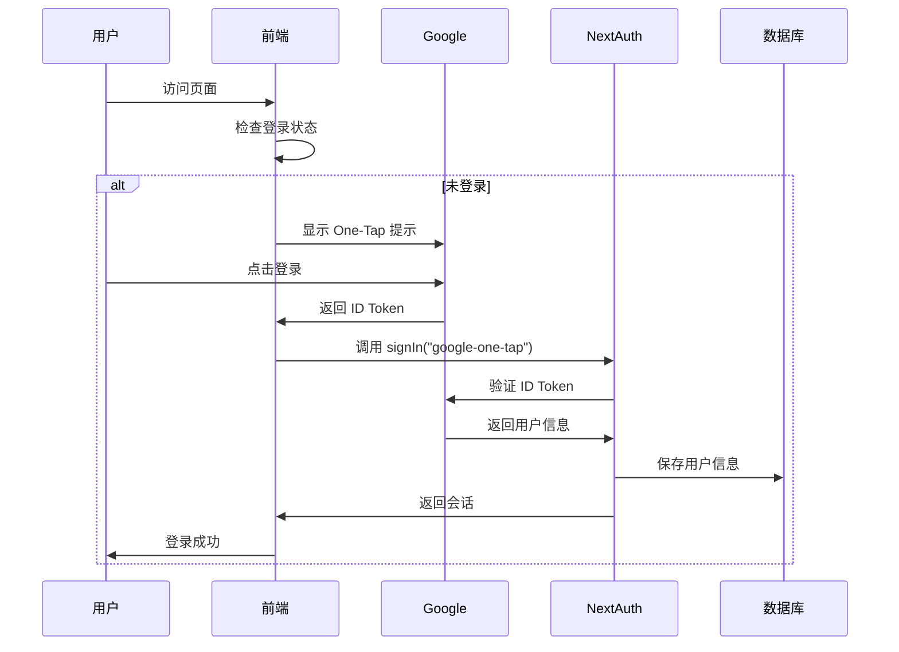
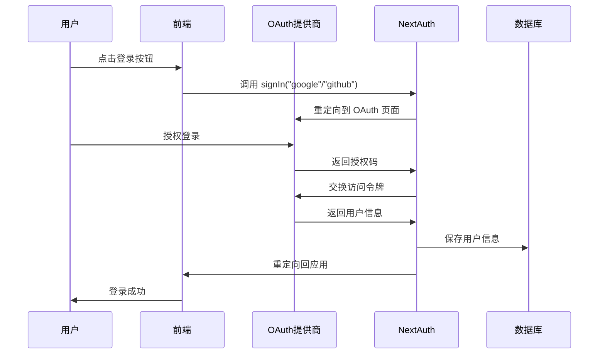

# Google One-Tap 登录系统完整实现指南

## 📋 概述

本项目基于 Next.js + NextAuth.js 实现了完整的登录系统，其中 **Google One-Tap 登录** 是核心特色功能，提供无缝的用户登录体验。系统同时支持传统的 Google OAuth 和 GitHub 登录。

## 🔧 环境变量配置

### 必需的环境变量

```bash
# Google One-Tap 登录 (必需)
NEXT_PUBLIC_AUTH_GOOGLE_ONE_TAP_ENABLED=true
NEXT_PUBLIC_AUTH_GOOGLE_ID=your_google_client_id

# 传统 Google OAuth 登录 (可选)
NEXT_PUBLIC_AUTH_GOOGLE_ENABLED=true
AUTH_GOOGLE_ID=your_google_client_id
AUTH_GOOGLE_SECRET=your_google_client_secret

# GitHub 登录 (可选)
NEXT_PUBLIC_AUTH_GITHUB_ENABLED=true
AUTH_GITHUB_ID=your_github_client_id
AUTH_GITHUB_SECRET=your_github_client_secret

# NextAuth.js 配置
NEXTAUTH_URL=http://localhost:3000
NEXTAUTH_SECRET=your_nextauth_secret

# 数据库配置 (Supabase)
SUPABASE_URL=your_supabase_url
SUPABASE_ANON_KEY=your_supabase_anon_key
SUPABASE_SERVICE_ROLE_KEY=your_supabase_service_role_key

# 其他配置
NEXT_PUBLIC_PROJECT_NAME=ShipAny
NEXT_PUBLIC_DEFAULT_THEME=light
```

### 环境变量说明

| 变量名 | 作用 | 是否必需 |
|--------|------|----------|
| `NEXT_PUBLIC_AUTH_GOOGLE_ONE_TAP_ENABLED` | 启用 Google One-Tap 登录 | ✅ |
| `NEXT_PUBLIC_AUTH_GOOGLE_ID` | Google OAuth 客户端 ID | ✅ |
| `AUTH_GOOGLE_ID` | 服务端 Google OAuth 客户端 ID | 传统登录需要 |
| `AUTH_GOOGLE_SECRET` | Google OAuth 客户端密钥 | 传统登录需要 |
| `NEXTAUTH_SECRET` | NextAuth.js 加密密钥 | ✅ |

## 📁 核心文件结构

```
shipany_v2/
├── auth/                          # 认证配置
│   ├── config.ts                  # NextAuth.js 配置
│   ├── index.ts                   # 认证导出
│   └── session.tsx                # 会话提供者组件
├── hooks/                         # 自定义 Hooks
│   └── useOneTapLogin.tsx         # Google One-Tap 登录 Hook
├── components/sign/               # 登录相关组件
│   ├── modal.tsx                  # 登录模态框
│   ├── form.tsx                   # 登录表单
│   ├── sign_in.tsx                # 登录按钮
│   ├── user.tsx                   # 用户信息组件
│   └── toggle.tsx                 # 登录状态切换
├── contexts/                      # React Context
│   └── app.tsx                    # 应用全局状态
├── app/api/auth/[...nextauth]/    # NextAuth.js API 路由
│   └── route.ts                   # 认证路由处理
├── app/[locale]/auth/signin/      # 登录页面
│   └── page.tsx                   # 登录页面组件
├── models/                        # 数据模型
│   └── db.ts                      # 数据库连接
├── services/                      # 业务服务
│   └── user.ts                    # 用户服务
└── types/                         # 类型定义
    ├── global.d.ts                # 全局类型声明
    ├── user.d.ts                  # 用户类型
    └── next-auth.d.ts             # NextAuth 类型扩展
```

## 🎯 Google One-Tap 登录核心实现

### 1. 类型声明 (`types/global.d.ts`)

```typescript
declare module "google-one-tap";
```

**作用**: 为 `google-one-tap` 包提供 TypeScript 类型支持。

### 2. One-Tap Hook (`hooks/useOneTapLogin.tsx`)

```typescript
"use client";

import googleOneTap from "google-one-tap";
import { signIn } from "next-auth/react";
import { useEffect } from "react";
import { useSession } from "next-auth/react";

export default function () {
  const { data: session, status } = useSession();

  const oneTapLogin = async function () {
    const options = {
      client_id: process.env.NEXT_PUBLIC_AUTH_GOOGLE_ID,
      auto_select: false,
      cancel_on_tap_outside: false,
      context: "signin",
    };

    googleOneTap(options, (response: any) => {
      console.log("onetap login ok", response);
      handleLogin(response.credential);
    });
  };

  const handleLogin = async function (credentials: string) {
    const res = await signIn("google-one-tap", {
      credential: credentials,
      redirect: false,
    });
    console.log("signIn ok", res);
  };

  useEffect(() => {
    if (status === "unauthenticated") {
      oneTapLogin();

      const intervalId = setInterval(() => {
        oneTapLogin();
      }, 3000);

      return () => {
        clearInterval(intervalId);
      };
    }
  }, [status]);

  return <></>;
}
```

**核心功能**:
- 🔄 **自动触发**: 检测到用户未登录时自动显示 One-Tap 提示
- ⏰ **定时重试**: 每3秒重新尝试显示登录提示
- 🎯 **无缝集成**: 获取到凭证后自动调用 NextAuth.js 登录
- 🛡️ **状态管理**: 基于 NextAuth 会话状态智能控制显示

### 3. 应用上下文集成 (`contexts/app.tsx`)

```typescript
export const AppContextProvider = ({ children }: { children: ReactNode }) => {
  // Google One-Tap 自动初始化
  if (
    process.env.NEXT_PUBLIC_AUTH_GOOGLE_ONE_TAP_ENABLED === "true" &&
    process.env.NEXT_PUBLIC_AUTH_GOOGLE_ID
  ) {
    useOneTapLogin();
  }

  const { data: session } = useSession();
  // ... 其他状态管理
};
```

**作用**: 在应用根级别自动初始化 Google One-Tap 功能。

## 🔐 NextAuth.js 认证配置

### 1. 认证配置 (`auth/config.ts`)

```typescript
import CredentialsProvider from "next-auth/providers/credentials";
import GoogleProvider from "next-auth/providers/google";
import GitHubProvider from "next-auth/providers/github";

let providers: Provider[] = [];

// Google One Tap 认证提供者
if (
  process.env.NEXT_PUBLIC_AUTH_GOOGLE_ONE_TAP_ENABLED === "true" &&
  process.env.NEXT_PUBLIC_AUTH_GOOGLE_ID
) {
  providers.push(
    CredentialsProvider({
      id: "google-one-tap",
      name: "google-one-tap",
      credentials: {
        credential: { type: "text" },
      },
      async authorize(credentials, req) {
        const googleClientId = process.env.NEXT_PUBLIC_AUTH_GOOGLE_ID;
        const token = credentials!.credential;

        // 验证 Google ID Token
        const response = await fetch(
          "https://oauth2.googleapis.com/tokeninfo?id_token=" + token
        );

        if (!response.ok) {
          console.log("Failed to verify token");
          return null;
        }

        const payload = await response.json();
        const {
          email,
          sub,
          given_name,
          family_name,
          email_verified,
          picture: image,
        } = payload;

        return {
          id: sub,
          name: [given_name, family_name].join(" "),
          email,
          image,
          emailVerified: email_verified ? new Date() : null,
        };
      },
    })
  );
}

// 传统 Google OAuth 提供者
if (
  process.env.NEXT_PUBLIC_AUTH_GOOGLE_ENABLED === "true" &&
  process.env.AUTH_GOOGLE_ID &&
  process.env.AUTH_GOOGLE_SECRET
) {
  providers.push(
    GoogleProvider({
      clientId: process.env.AUTH_GOOGLE_ID,
      clientSecret: process.env.AUTH_GOOGLE_SECRET,
    })
  );
}

// GitHub OAuth 提供者
if (
  process.env.NEXT_PUBLIC_AUTH_GITHUB_ENABLED === "true" &&
  process.env.AUTH_GITHUB_ID &&
  process.env.AUTH_GITHUB_SECRET
) {
  providers.push(
    GitHubProvider({
      clientId: process.env.AUTH_GITHUB_ID,
      clientSecret: process.env.AUTH_GITHUB_SECRET,
    })
  );
}
```

**核心机制**:
- 🔍 **Token 验证**: 通过 Google 官方 API 验证 ID Token 的有效性
- 📊 **用户信息提取**: 从 Token 中提取用户基本信息
- 🛡️ **安全检查**: 验证邮箱、用户 ID 等关键信息
- 🔄 **标准化处理**: 将 Google 用户信息转换为 NextAuth 标准格式

### 2. JWT 回调处理

```typescript
async jwt({ token, user, account }) {
  try {
    if (user && user.email && account) {
      const dbUser: User = {
        uuid: getUuid(),
        email: user.email,
        nickname: user.name || "",
        avatar_url: user.image || "",
        signin_type: account.type,
        signin_provider: account.provider,
        signin_openid: account.providerAccountId,
        created_at: getIsoTimestr(),
        signin_ip: await getClientIp(),
      };

      const savedUser = await saveUser(dbUser);
      token.user = {
        uuid: savedUser.uuid,
        email: savedUser.email,
        nickname: savedUser.nickname,
        avatar_url: savedUser.avatar_url,
        created_at: savedUser.created_at,
      };
    }
  } catch (e) {
    console.error("save user failed:", e);
  }
  return token;
}
```

**功能说明**:
- 💾 **自动保存**: 登录成功后自动将用户信息保存到数据库
- 🆔 **UUID 生成**: 为每个用户生成唯一标识符
- 📍 **IP 记录**: 记录用户登录 IP 地址
- 🏷️ **提供商标记**: 记录登录方式（google-one-tap, google, github）

### 3. API 路由 (`app/api/auth/[...nextauth]/route.ts`)

```typescript
import { handlers } from "@/auth";

export const { GET, POST } = handlers;
```

**作用**: 导出 NextAuth.js 的 HTTP 处理器，处理所有认证相关的 API 请求。

## 🎨 UI 组件系统

### 1. 登录模态框 (`components/sign/modal.tsx`)

```typescript
export default function SignModal() {
  const { showSignModal, setShowSignModal } = useAppContext();
  const isDesktop = useMediaQuery("(min-width: 768px)");

  if (isDesktop) {
    return (
      <Dialog open={showSignModal} onOpenChange={setShowSignModal}>
        <DialogContent className="sm:max-w-[425px]">
          <DialogHeader>
            <DialogTitle>{t("sign_modal.sign_in_title")}</DialogTitle>
            <DialogDescription>
              {t("sign_modal.sign_in_description")}
            </DialogDescription>
          </DialogHeader>
          <ProfileForm />
        </DialogContent>
      </Dialog>
    );
  }

  return (
    <Drawer open={showSignModal} onOpenChange={setShowSignModal}>
      {/* Mobile 登录界面 */}
    </Drawer>
  );
}
```

**特点**:
- 📱 **响应式设计**: 桌面端使用 Dialog，移动端使用 Drawer
- 🌍 **国际化支持**: 支持多语言界面
- 🎛️ **状态管理**: 通过 Context 管理模态框显示状态

### 2. 登录表单 (`components/sign/form.tsx`)

```typescript
function ProfileForm({ className }: React.ComponentProps<"form">) {
  const t = useTranslations();

  return (
    <div className={cn("grid items-start gap-4", className)}>
      {/* Google 登录按钮 */}
      {process.env.NEXT_PUBLIC_AUTH_GOOGLE_ENABLED === "true" && (
        <Button
          variant="outline"
          className="w-full flex items-center gap-2"
          onClick={() => signIn("google")}
        >
          <SiGoogle className="w-4 h-4" />
          {t("sign_modal.google_sign_in")}
        </Button>
      )}

      {/* GitHub 登录按钮 */}
      {process.env.NEXT_PUBLIC_AUTH_GITHUB_ENABLED === "true" && (
        <Button
          variant="outline"
          className="w-full flex items-center gap-2"
          onClick={() => signIn("github")}
        >
          <SiGithub className="w-4 h-4" />
          {t("sign_modal.github_sign_in")}
        </Button>
      )}
    </div>
  );
}
```

**特点**:
- 🔧 **条件渲染**: 根据环境变量动态显示登录选项
- 🎨 **统一样式**: 使用 Shadcn UI 组件保持设计一致性
- 🌐 **多平台支持**: 同时支持 Google 和 GitHub 登录

### 3. 用户状态切换 (`components/sign/toggle.tsx`)

```typescript
export default function SignToggle() {
  const { user } = useAppContext();

  return (
    <div className="flex items-center gap-x-2 px-2 cursor-pointer">
      {user ? <User user={user} /> : <SignIn />}
    </div>
  );
}
```

**作用**: 根据用户登录状态显示不同的 UI 组件。

## 💾 数据库集成

### 1. 数据库连接 (`models/db.ts`)

```typescript
import { createClient } from "@supabase/supabase-js";

export function getSupabaseClient() {
  const supabaseUrl = process.env.SUPABASE_URL || "";

  let supabaseKey = process.env.SUPABASE_ANON_KEY || "";
  if (process.env.SUPABASE_SERVICE_ROLE_KEY) {
    supabaseKey = process.env.SUPABASE_SERVICE_ROLE_KEY;
  }

  if (!supabaseUrl || !supabaseKey) {
    throw new Error("Supabase URL or key is not set");
  }

  const client = createClient(supabaseUrl, supabaseKey);
  return client;
}
```

### 2. 用户数据表结构 (`data/install.sql`)

```sql
CREATE TABLE users (
    id SERIAL PRIMARY KEY,
    uuid VARCHAR(255) UNIQUE NOT NULL,
    email VARCHAR(255) NOT NULL,
    created_at timestamptz,
    nickname VARCHAR(255),
    avatar_url VARCHAR(255),
    locale VARCHAR(50),
    signin_type VARCHAR(50),
    signin_ip VARCHAR(255),
    signin_provider VARCHAR(50),
    signin_openid VARCHAR(255),
    invite_code VARCHAR(255) NOT NULL default '',
    updated_at timestamptz,
    invited_by VARCHAR(255) NOT NULL default '',
    is_affiliate BOOLEAN NOT NULL default false,
    UNIQUE (email, signin_provider)
);
```

**字段说明**:
- `signin_provider`: 记录登录提供商（google-one-tap, google, github）
- `signin_openid`: 记录第三方平台的用户 ID
- `signin_ip`: 记录登录时的 IP 地址
- `signin_type`: 记录认证类型（oauth, credentials）

## 🔄 登录流程详解

### Google One-Tap 登录流程



### 传统 OAuth 登录流程



## 📦 依赖包说明

### 核心依赖

```json
{
  "dependencies": {
    "next-auth": "5.0.0-beta.25",
    "google-one-tap": "^1.0.6",
    "@supabase/supabase-js": "^2.47.10"
  }
}
```

**包说明**:
- `next-auth`: NextAuth.js 认证框架
- `google-one-tap`: Google One-Tap 登录 SDK
- `@supabase/supabase-js`: Supabase 数据库客户端

### 类型定义

```typescript
// types/next-auth.d.ts
declare module "next-auth" {
  interface Session {
    user: {
      uuid: string;
      email: string;
      nickname: string;
      avatar_url: string;
      created_at: string;
    };
  }
}

// types/user.d.ts
export interface User {
  uuid: string;
  email: string;
  nickname: string;
  avatar_url: string;
  signin_type: string;
  signin_provider: string;
  signin_openid: string;
  created_at: string;
  signin_ip: string;
}
```

## ⚙️ Google OAuth 配置指南

### 1. 创建 Google OAuth 应用

1. 访问 [Google Cloud Console](https://console.cloud.google.com/)
2. 创建新项目或选择现有项目
3. 启用 Google+ API
4. 创建 OAuth 2.0 客户端 ID
5. 配置授权重定向 URI：
   - 开发环境: `http://localhost:3000/api/auth/callback/google`
   - 生产环境: `https://yourdomain.com/api/auth/callback/google`

### 2. 获取客户端凭据

- **客户端 ID**: 用于 `NEXT_PUBLIC_AUTH_GOOGLE_ID` 和 `AUTH_GOOGLE_ID`
- **客户端密钥**: 用于 `AUTH_GOOGLE_SECRET`

### 3. One-Tap 特殊配置

Google One-Tap 需要额外配置：
- 在 Google Cloud Console 中启用 "Google Identity Services"
- 确保域名已验证（生产环境）
- 配置授权的 JavaScript 源

## 🚀 部署配置

### 环境变量设置

```bash
# .env.local (开发环境)
NEXT_PUBLIC_AUTH_GOOGLE_ONE_TAP_ENABLED=true
NEXT_PUBLIC_AUTH_GOOGLE_ID=your_google_client_id
NEXTAUTH_URL=http://localhost:3000
NEXTAUTH_SECRET=your_development_secret

# .env.production (生产环境)
NEXT_PUBLIC_AUTH_GOOGLE_ONE_TAP_ENABLED=true
NEXT_PUBLIC_AUTH_GOOGLE_ID=your_google_client_id
NEXTAUTH_URL=https://yourdomain.com
NEXTAUTH_SECRET=your_production_secret
```

### Vercel 部署

1. 在 Vercel 项目设置中添加环境变量
2. 确保 `NEXTAUTH_URL` 设置为正确的域名
3. 在 Google Cloud Console 中添加生产域名到授权源

### Cloudflare Pages 部署

```toml
# wrangler.toml
[vars]
NEXT_PUBLIC_AUTH_GOOGLE_ONE_TAP_ENABLED = "true"
NEXT_PUBLIC_AUTH_GOOGLE_ID = "your_google_client_id"
NEXTAUTH_URL = "https://yourdomain.com"
```

## 🔧 故障排除

### 常见问题

1. **One-Tap 不显示**
   - 检查 `NEXT_PUBLIC_AUTH_GOOGLE_ONE_TAP_ENABLED` 是否为 "true"
   - 确认 `NEXT_PUBLIC_AUTH_GOOGLE_ID` 已正确设置
   - 检查浏览器控制台是否有错误信息

2. **Token 验证失败**
   - 确认 Google Client ID 正确
   - 检查网络连接到 Google API
   - 验证 ID Token 格式是否正确

3. **数据库保存失败**
   - 检查 Supabase 连接配置
   - 确认数据库表结构正确
   - 检查用户权限设置

4. **重定向错误**
   - 确认 `NEXTAUTH_URL` 设置正确
   - 检查 Google OAuth 重定向 URI 配置
   - 验证域名是否已在 Google Console 中授权

### 调试技巧

```typescript
// 在 useOneTapLogin.tsx 中添加调试日志
console.log("One-tap status:", status);
console.log("One-tap options:", options);
console.log("One-tap response:", response);

// 在 auth/config.ts 中添加调试日志
console.log("Token verification response:", payload);
console.log("User data:", user);
```

## 📊 性能优化

### 1. 减少重复请求
- One-Tap 使用 3 秒间隔避免频繁请求
- 基于会话状态智能控制显示

### 2. 异步加载
- Google One-Tap SDK 异步加载
- 不阻塞页面主要内容渲染

### 3. 缓存策略
- NextAuth.js 自动处理会话缓存
- Supabase 客户端连接复用

## 🎯 最佳实践

### 1. 安全性
- 始终验证 ID Token 的有效性
- 使用 HTTPS 在生产环境中
- 定期轮换 OAuth 密钥

### 2. 用户体验
- 提供清晰的登录状态反馈
- 支持多种登录方式
- 优雅处理登录失败情况

### 3. 可维护性
- 使用环境变量管理配置
- 模块化组件设计
- 完善的错误处理和日志记录

## 📝 总结

本项目实现了一个功能完整、用户体验优秀的登录系统：

### 🌟 核心特色
- **Google One-Tap**: 提供最流畅的登录体验
- **多平台支持**: Google、GitHub 多种登录方式
- **响应式设计**: 适配桌面和移动设备
- **国际化**: 支持多语言界面
- **安全可靠**: 基于 NextAuth.js 和官方 OAuth

### 🔧 技术栈
- **前端**: Next.js 15 + React 19 + TypeScript
- **认证**: NextAuth.js 5.0 + Google One-Tap
- **数据库**: Supabase PostgreSQL
- **UI**: Shadcn UI + Tailwind CSS
- **状态管理**: React Context + NextAuth Session

### 📈 优势
1. **开发效率**: 开箱即用的完整解决方案
2. **用户体验**: One-Tap 登录提供极佳的用户体验
3. **可扩展性**: 模块化设计，易于添加新的登录方式
4. **安全性**: 基于行业标准的 OAuth 2.0 协议
5. **维护性**: 清晰的代码结构和完善的文档

这个登录系统为现代 Web 应用提供了一个完整、可靠的用户认证解决方案。